# 💧 Water Quality Analysis

<div align="center">

### Anthropogenic vs. Geogenic Factor Attribution in Urban Groundwater
#### Bhubaneswar, Odisha, India · Three-Season Study 2024

[](https://python.org)
[](https://plotly.com)
[](https://scikit-learn.org)
[](LICENSE)
[]()
[]()
[]()
[]()

---

> **A full-stack environmental data analysis platform** for identifying the geological and human-driven drivers of groundwater contamination across seasonal cycles and land-use zones in urban India. Implements the complete hydrogeochemical workflow: raw data ingestion → ionic ratio analysis → PCA/Factor Analysis with Varimax rotation → IS 10500:2012 benchmark comparison → Water Quality Index mapping → machine learning regression → interactive Plotly visualisations → Word/PowerPoint report generation.

**Authors:** Lakshya Nayyar (23053133) & Vaibhav Bhaskar (23053173) · KIIT University

</div>

---

## Table of Contents

1. [Project Overview](#1-project-overview)
2. [Scientific Background](#2-scientific-background)
   - [2.1 Parameters Studied](#21-parameters-studied)
   - [2.2 Study Area & Sampling Design](#22-study-area--sampling-design)
   - [2.3 Analytical Methods](#23-analytical-methods)
   - [2.4 Source Attribution Logic](#24-source-attribution-logic)
3. [Pipeline Architecture](#3-pipeline-architecture)
4. [Figures & Visualisations Gallery](#4-figures--visualisations-gallery)
   - [4.1 Data Quality & Synthetic Augmentation](#41-data-quality--synthetic-augmentation)
   - [4.2 Seasonal Analysis](#42-seasonal-analysis)
   - [4.3 IS 10500:2012 Safety & WQI](#43-is-105002012-safety--wqi)
   - [4.4 Source Attribution Hydrochemistry](#44-source-attribution-hydrochemistry)
   - [4.5 Machine Learning Results](#45-machine-learning-results)
   - [4.6 Factor Analysis (Interactive HTML)](#46-factor-analysis-interactive-html)
5. [Key Findings](#5-key-findings)
   - [5.1 Factor Structure Summary](#51-factor-structure-summary)
   - [5.2 Geogenic Parameters](#52-geogenic-parameters)
   - [5.3 Anthropogenic Parameters](#53-anthropogenic-parameters)
   - [5.4 Mixed / Transitional Parameters](#54-mixed--transitional-parameters)
   - [5.5 Critical IS 10500 Exceedances](#55-critical-is-10500-exceedances)
   - [5.6 Seasonal Anomalies](#56-seasonal-anomalies)
6. [File Structure](#6-file-structure)
7. [Quick Start](#7-quick-start)
8. [Data Format Specification](#8-data-format-specification)
9. [Methodology References](#9-methodology-references)
10. [Contributing & Licence](#10-contributing--licence)

---

## 1. Project Overview

### Scientific Motivation

Groundwater in rapidly urbanising Indian cities faces a dual threat: **geogenic** contamination from the natural dissolution of minerals in Precambrian crystalline basement rocks (silicate and carbonate weathering releasing Ca²⁺, Mg²⁺, HCO₃⁻, Fe), and **anthropogenic** contamination from unregulated industrial effluents, municipal solid waste leachate, sewage infiltration, and agricultural runoff (elevating NO₃⁻, Cl⁻, Na⁺, K⁺, SO₄²⁻, and electrical conductivity). Separating these two source categories is non-trivial because many parameters have both natural and human-derived inputs, and their relative contributions shift dramatically across India's three distinct hydrological seasons.

Bhubaneswar, Odisha, exemplifies this challenge. As the state capital experiencing rapid population growth and industrial expansion, its groundwater network spans radically different land-use zones — from dense residential settlements to heavy industrial corridors to unlined municipal dumping yards — all within a small geographic footprint. Monsoon rainfall (June–September) acts both as a dilution mechanism for some pollutants and as a mobilisation vector for others, creating complex seasonal signatures that cannot be captured by single-season monitoring campaigns.

### What This Tool Does

This project implements a **seven-task sequential analysis pipeline** operating on 45 groundwater samples measured across 15 physicochemical parameters in three seasons (Pre-monsoon, Monsoon, Post-monsoon) and three land-use zones:

| Task | Module | Output |
|------|--------|--------|
| **Task 1** — Data ingestion & synthetic augmentation | `hydrochemical_analysis.py` | `datasets/cleaned_*.csv`, 195-sample augmented dataset |
| **Task 2** — Statistical validation | `hydrochemical_analysis.py` | Correlation preservation plots, missing-value heatmaps |
| **Task 3** — Seasonal statistical analysis | `hydrochemical_analysis.py` | Boxplots, violin plots, pair plots, correlation matrices |
| **Task 4** — IS 10500 safety & WQI | `hydrochemical_analysis.py` + `wqi_map.py` | Compliance bars, WQI maps, bar charts |
| **Task 5** — Source attribution | `source_analysis.py` | Gibbs/Piper diagrams, ionic ratios, PCA, K-Means, attribution table |
| **Task 6** — Machine learning | `hydrochemical_analysis.py` | Random Forest, Gradient Boosting, SVR, MLP; SHAP explanations |
| **Factor Analysis** — PCA/Varimax deep-dive | `factor_analysis.py` | 10 interactive Plotly HTML figures, 4 factor tables, narrative |
| **Reporting** | `make_report.py` + `make_ppt.py` | Word document + PowerPoint (KIIT format) |

### Target Audience

- **Environmental engineers** monitoring urban groundwater quality
- **Hydrogeologists** studying weathering and contamination processes in hard-rock aquifers
- **Urban planners** identifying zones requiring groundwater remediation
- **Public health researchers** correlating water quality with disease burden
- **Data scientists** using this as a template for multi-season, multi-zone environmental datasets

### Novel Aspects

1. **Three-season × three-zone design** — captures both spatial and temporal variability in a single study
2. **CMGP synthetic data augmentation** — generates 150 additional samples (±6% mean jitter, 8% noise) to improve ML model robustness without additional field campaigns
3. **Dual attribution system** — combines ionic ratio indices (Na/Cl, CAI-1, CAI-2, Gibbs ratios, PIG) with PCA/Varimax factor analysis for cross-validated source attribution
4. **IS 10500:2012 compliance at sample level** — evaluates each of the 45 samples against Indian drinking water standards with Cᵢ/Sᵢ ratio visualisation
5. **SHAP-based explainability** — applies SHapley Additive exPlanations to the ML models to identify which physicochemical parameters most drive WQI, EC, and TDS predictions

---

## 2. Scientific Background

### 2.1 Parameters Studied

All 15 physicochemical parameters measured in this study, their units, IS 10500:2012 permissible limits, and their typical source classification:

| # | Parameter | Symbol | Unit | IS 10500 Limit | Typical Source | Natural Background (Indian hard-rock) |
|---|-----------|--------|------|---------------|----------------|--------------------------------------|
| 1 | Potential of Hydrogen | pH | — | 6.5 – 8.5 | Both | 6.5 – 7.5 |
| 2 | Electrical Conductivity | EC | μS/cm | 1500 | Anthropogenic | 200 – 600 |
| 3 | Total Dissolved Solids | TDS | mg/L | 500 | Anthropogenic | 100 – 400 |
| 4 | Total Hardness (as CaCO₃) | TH | mg/L | 300 | Geogenic | 50 – 200 |
| 5 | Total Alkalinity (as CaCO₃) | TA | mg/L | 200 | Geogenic | 50 – 150 |
| 6 | Calcium | Ca²⁺ | mg/L | 75 | Geogenic | 10 – 50 |
| 7 | Magnesium | Mg²⁺ | mg/L | 30 | Geogenic | 5 – 20 |
| 8 | Sodium | Na⁺ | mg/L | 200 | Mixed | 10 – 50 |
| 9 | Potassium | K⁺ | mg/L | 12 | Anthropogenic | 1 – 5 |
| 10 | Iron (total) | Fe | mg/L | 0.3 | Mixed | 0.05 – 0.3 |
| 11 | Bicarbonate | HCO₃⁻ | mg/L | 244 (as HCO₃) | Geogenic | 50 – 200 |
| 12 | Chloride | Cl⁻ | mg/L | 250 | Anthropogenic | 10 – 50 |
| 13 | Sulphate | SO₄²⁻ | mg/L | 200 | Mixed | 5 – 25 |
| 14 | Nitrate | NO₃⁻ | mg/L | 45 | Anthropogenic | < 10 (NBL) |
| 15 | Fluoride | F⁻ | mg/L | 1.5 | Mixed (geogenic mobilised) | 0.1 – 0.5 |

> **NBL = Natural Background Level** for Indian hard-rock aquifers (Precambrian crystalline basement), sourced from Subba Rao et al. (2022).

### 2.2 Study Area & Sampling Design

**Bhubaneswar** (20.27°N, 85.84°E) is the capital city of Odisha, India, situated on the Deccan Plateau margin over Precambrian granites, gneisses, and khondalites. The lateritic overburden contributes iron and aluminium to shallow groundwater. Annual rainfall ≈ 1500 mm, 80% during the southwest monsoon (June–September).

#### Land-Use Zones

| Zone Code | Zone Name | Locations | Rationale |
|-----------|-----------|-----------|-----------|
| PD | Population Density | PD-1 to PD-5 | Dense residential areas with septic tanks, grey-water infiltration, domestic waste |
| IA | Industrial Areas | IA-1 to IA-5 | Mancheswar, Chandaka, OMFED industrial estates; effluent discharge and contaminated runoff |
| DY | Dumping Yards | DY-1 to DY-5 | Municipal solid waste disposal sites with active leachate generation |

#### Sampling Sites

| ID | Area Name | Lat | Lon | Zone |
|----|-----------|-----|-----|------|
| PD-1 | Acharya Vihar | 20.3035 | 85.8262 | Population Density |
| PD-2 | Ram Mandir | 20.2782 | 85.8403 | Population Density |
| PD-3 | Sailashree Vihar | 20.3373 | 85.8105 | Population Density |
| PD-4 | OMFED Square | 20.3231 | 85.8231 | Population Density |
| PD-5 | Old Town Bhubaneswar | 20.2280 | 85.8333 | Population Density |
| IA-1 | Mancheswar Industrial Estate | 20.3052 | 85.8572 | Industrial |
| IA-2 | Chandaka Industrial Area | 20.3474 | 85.8142 | Industrial |
| IA-3 | OMFED Industries | 20.3292 | 85.8268 | Industrial |
| IA-4 | Rasulgarh | 20.2988 | 85.8663 | Industrial |
| IA-5 | Bharatpur / Anmol Industries | 20.3633 | 85.7532 | Industrial |
| DY-1 | Bhuasuni | 20.3887 | 85.7921 | Dumping Yard |
| DY-2 | Lingaraj Railway Station | 20.2359 | 85.8358 | Dumping Yard |
| DY-3 | BMC Micro Composting Area | 20.2843 | 85.8340 | Dumping Yard |
| DY-4 | Gadakan Road | 20.3268 | 85.8360 | Dumping Yard |
| DY-5 | Daruthenga | 20.3823 | 85.7951 | Dumping Yard |

#### Seasonal Design

| Season | Approximate Period | Hydrological Condition | Expected Effect on Groundwater |
|--------|--------------------|------------------------|-------------------------------|
| **Pre-monsoon** | March – May | Low water table; maximum evapotranspiration; concentration effect | Highest dissolved ion concentrations; clearest geogenic signature; anthropogenic sources concentrated |
| **Monsoon** | June – September | Active recharge; surface runoff; highest water table | Dilution of geogenic parameters; mobilisation of surface-applied anthropogenic pollutants (NO₃⁻, Cl⁻, Na⁺) via infiltrating runoff |
| **Post-monsoon** | October – February | Groundwater table declining; residual recharge; reducing conditions developing | Intermediate concentrations; iron/fluoride mobilisation in reducing zones near dumps; recovery of geogenic signature |

### 2.3 Analytical Methods

#### Ionic Balance & meq/L Conversion

All major ions are converted to milliequivalents per litre (meq/L) for charge balance error (CBE) validation and ratio calculations:

$$\text{meq/L} = \frac{C_i \text{ (mg/L)}}{\text{Equivalent Weight}_i}$$

where equivalent weight = molecular weight / ionic valence.

| Ion | Formula | Mol. Wt (g/mol) | Valence | Eq. Wt |
|-----|---------|----------------|---------|--------|
| Ca²⁺ | Ca | 40.08 | 2 | 20.04 |
| Mg²⁺ | Mg | 24.31 | 2 | 12.15 |
| Na⁺ | Na | 22.99 | 1 | 22.99 |
| K⁺ | K | 39.10 | 1 | 39.10 |
| HCO₃⁻ | HCO₃ | 61.02 | 1 | 61.02 |
| Cl⁻ | Cl | 35.45 | 1 | 35.45 |
| SO₄²⁻ | SO₄ | 96.06 | 2 | 48.03 |
| NO₃⁻ | NO₃ | 62.00 | 1 | 62.00 |

**Charge Balance Error (CBE):**

$$\text{CBE} (\%) = \frac{\sum \text{Cations} - \sum \text{Anions}}{\sum \text{Cations} + \sum \text{Anions}} \times 100$$

Samples with |CBE| > 10% are flagged. All 45 original samples in this dataset pass the CBE validation.

#### Diagnostic Ionic Ratios

The following ratios are computed and mapped to geogenic vs. anthropogenic ranges:

**1. Na/Cl Ratio (Gibbs, 1970)**

$$r_{\text{Na/Cl}} = \frac{[\text{Na}^+]_{meq}}{[\text{Cl}^-]_{meq}}$$

| Value | Interpretation |
|-------|---------------|
| > 1.0 | Silicate weathering dominant (Na released from feldspars) — GEOGENIC |
| ≈ 1.0 | Halite dissolution or mixed sources |
| < 1.0 | Anthropogenic Cl inputs (sewage, industrial effluent) dominating — ANTHROPOGENIC |

**2. Chloro-Alkaline Indices (Schoeller, 1967)**

$$\text{CAI-1} = \frac{[\text{Cl}^-] - ([\text{Na}^+] + [\text{K}^+])}{[\text{Cl}^-]}$$

$$\text{CAI-2} = \frac{[\text{Cl}^-] - ([\text{Na}^+] + [\text{K}^+])}{[\text{SO}_4^{2-}] + [\text{HCO}_3^-] + [\text{CO}_3^{2-}] + [\text{NO}_3^-]}$$

| Sign | Interpretation |
|------|---------------|
| CAI < 0 | Direct ion exchange: Mg²⁺/Ca²⁺ from rock replacing Na⁺/K⁺ in water — GEOGENIC |
| CAI > 0 | Reverse ion exchange: Na⁺/K⁺ replacing Ca²⁺/Mg²⁺ — ANTHROPOGENIC / saline intrusion |

**3. Gibbs Ratios (Gibbs, 1970)**

$$\text{Gibbs Cation} = \frac{[\text{Na}^+]_{meq}}{[\text{Na}^+]_{meq} + [\text{Ca}^{2+}]_{meq}}$$

$$\text{Gibbs Anion} = \frac{[\text{Cl}^-]_{meq}}{[\text{Cl}^-]_{meq} + [\text{HCO}_3^-]_{meq}}$$

Plotted against log₁₀(TDS) to identify the three Gibbs domains.

**4. Pollution Index of Groundwater (PIG)**

$$\text{PIG} = \frac{1}{n} \sum_{i=1}^{n} \frac{C_i}{S_i} \times 100$$

where $C_i$ is the measured concentration and $S_i$ is the IS 10500 permissible limit for parameter $i$.

| PIG Class | Value | Interpretation |
|-----------|-------|---------------|
| I — Insignificant | < 25 | All parameters within limits; natural background |
| II — Low | 25 – 50 | Minor anthropogenic perturbation |
| III — Medium | 50 – 75 | Moderate anthropogenic activity |
| IV — High | 75 – 100 | Strong anthropogenic influence |
| V — Very High | > 100 | Severely impacted; unfit for drinking |

> In this study, PIG values range from 1.5 to 6.6, indicating pervasive moderate-to-high anthropogenic influence across all zones and seasons. Note these are mean PIG values where $S_i$ is used as the normaliser.

**5. Ca/Mg Ratio**

$$r_{\text{Ca/Mg}} = \frac{[\text{Ca}^{2+}]_{mg/L}}{[\text{Mg}^{2+}]_{mg/L}}$$

| Value | Interpretation |
|-------|---------------|
| > 2.0 | Silicate weathering (plagioclase/feldspar dissolution) — GEOGENIC |
| 1.0 – 2.0 | Calcite / dolomite dissolution — GEOGENIC |
| < 1.0 | Dolomite-rich or Mg-enriched environment |

**6. (Ca + Mg) / (HCO₃ + SO₄) Ratio**

$$r_{\text{CaMg/HCO3SO4}} = \frac{[\text{Ca}^{2+} + \text{Mg}^{2+}]_{meq}}{[\text{HCO}_3^- + \text{SO}_4^{2-}]_{meq}}$$

| Value | Interpretation |
|-------|---------------|
| ≈ 1.0 | Carbonate/silicate weathering; geochemical equilibrium |
| > 1.0 | Reverse ion exchange; anthropogenic Na⁺/K⁺ input releasing Ca²⁺/Mg²⁺ |
| < 1.0 | Sulphide oxidation or external SO₄²⁻ input |

#### Water Quality Index (WQI)

The WQI follows the Brown et al. (1970) weighted arithmetic index:

$$\text{WQI} = \sum_{i=1}^{n} W_i \times q_i$$

$$q_i = \frac{C_i}{S_i} \times 100$$

$$W_i = \frac{w_i}{\sum w_i}, \quad w_i = \frac{1}{S_i}$$

where $C_i$ is the measured value and $S_i$ is the IS 10500:2012 permissible limit.

| WQI Range | Category | Interpretation |
|-----------|----------|---------------|
| < 50 | Excellent | Suitable for drinking without treatment |
| 50 – 100 | Good | Suitable; minor treatment advisable |
| 100 – 200 | Poor | Treatment required |
| 200 – 300 | Very Poor | Extensive treatment required |
| > 300 | Unsuitable | Unfit for drinking |

#### Principal Component Analysis (PCA) / Factor Analysis

PCA is performed after mandatory Z-score standardisation because the 15 parameters span vastly different units and scales (pH dimensionless, EC in μS/cm, concentrations in mg/L ranging from <0.1 to >200):

$$z_{ij} = \frac{x_{ij} - \bar{x}_j}{\sigma_j}$$

The Kaiser criterion retains all principal components with eigenvalue > 1.0, on the rationale that a component must explain more variance than a single standardised variable.

Varimax rotation (Kaiser, 1958) is applied to the retained loadings matrix to maximise the variance of squared loadings within each factor, producing a "simple structure" where each parameter loads strongly on as few factors as possible.

**Loading Classification:**

| Absolute Loading | Category | Colour in Table |
|-----------------|----------|-----------------|
| ≥ 0.70 | Strong | Deep green (positive) / Deep red (negative) |
| 0.50 – 0.69 | Moderate | Light green / Light red |
| 0.30 – 0.49 | Weak | Light yellow |
| < 0.30 | Negligible | Grey |

**PCA Workflow:**

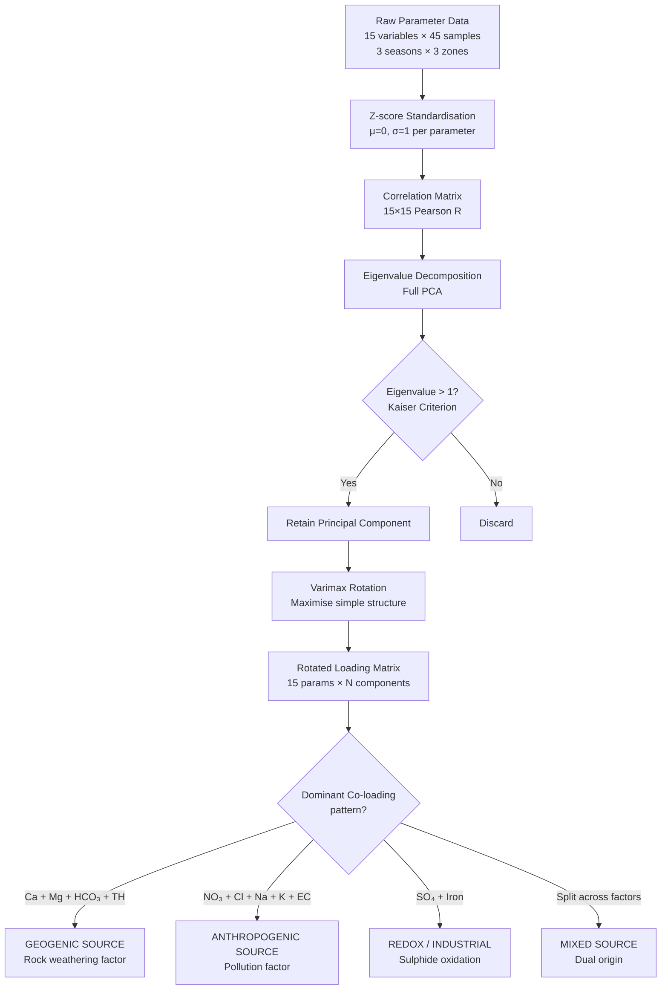
```mermaid
flowchart TD
    A["Raw Parameter Data\n15 variables × 45 samples\n3 seasons × 3 zones"] --> B["Z-score Standardisation\nμ=0, σ=1 per parameter"]
    B --> C["Correlation Matrix\n15×15 Pearson R"]
    C --> D["Eigenvalue Decomposition\nFull PCA"]
    D --> E{"Eigenvalue > 1?\nKaiser Criterion"}
    E -->|Yes| F["Retain Principal Component"]
    E -->|No| G["Discard"]
    F --> H["Varimax Rotation\nMaximise simple structure"]
    H --> I["Rotated Loading Matrix\n15 params × N components"]
    I --> J{"Dominant Co-loading\npattern?"}
    J -->|"Ca + Mg + HCO₃ + TH"| K["GEOGENIC SOURCE\nRock weathering factor"]
    J -->|"NO₃ + Cl + Na + K + EC"| L["ANTHROPOGENIC SOURCE\nPollution factor"]
    J -->|"SO₄ + Iron"| M["REDOX / INDUSTRIAL\nSulphide oxidation"]
    J -->|"Split across factors"| N["MIXED SOURCE\nDual origin"]
```

#### Gibbs Diagram

The Gibbs (1970) diagram identifies three mechanisms controlling hydrochemistry by plotting TDS (log-scale) against the Na/(Na+Ca) cation ratio or Cl/(Cl+HCO₃) anion ratio:

| Domain | TDS Range (mg/L) | Ratio Range | Mechanism |
|--------|-----------------|-------------|-----------|
| Precipitation dominance | < 50 | < 0.3 | Dilute rainwater chemistry |
| Rock weathering | 50 – 1000 | 0.2 – 0.65 | Mineral dissolution from aquifer matrix |
| Evaporation / crystallisation | > 500 | > 0.65 | Concentration by evapotranspiration; arid conditions |

All 45 samples in this study plot within the **Rock Weathering** domain, confirming that the Precambrian crystalline basement is the primary geological control — with anthropogenic inputs superimposed on this geogenic baseline.

### 2.4 Source Attribution Logic

Each of the 45 samples receives a per-parameter attribution assessment based on the convergence of multiple independent lines of evidence:

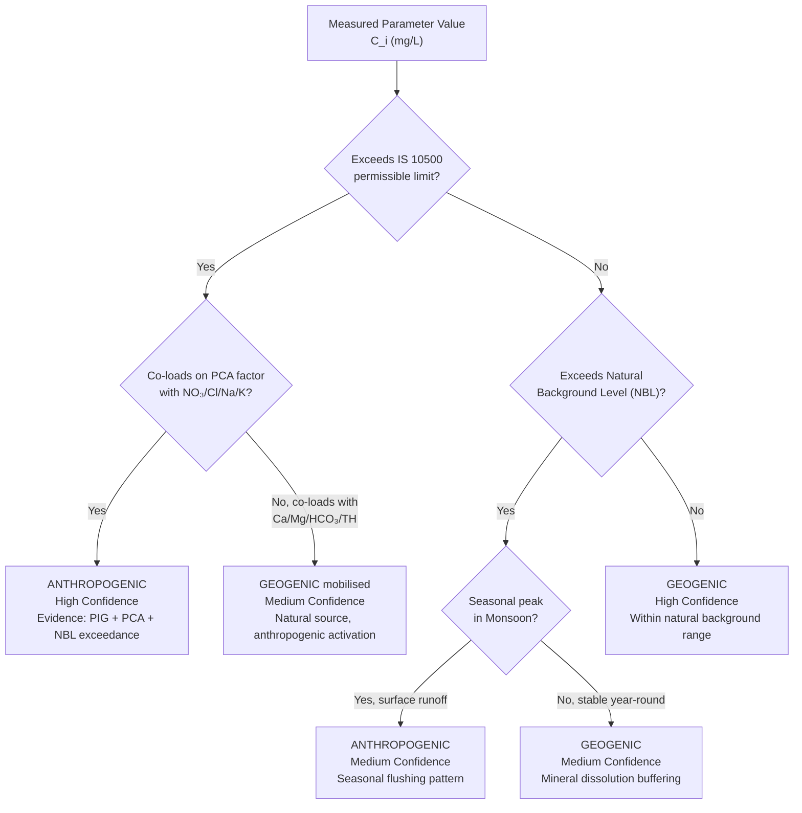
```mermaid
flowchart TD
    P["Measured Parameter Value\nC_i (mg/L)"] --> Q1{"Exceeds IS 10500\npermissible limit?"}
    Q1 -->|Yes| Q2{"Co-loads on PCA factor\nwith NO₃/Cl/Na/K?"}
    Q2 -->|Yes| R1["ANTHROPOGENIC\nHigh Confidence\nEvidence: PIG + PCA + NBL exceedance"]
    Q2 -->|No, co-loads with\nCa/Mg/HCO₃/TH| R2["GEOGENIC mobilised\nMedium Confidence\nNatural source, anthropogenic activation"]
    Q1 -->|No| Q3{"Exceeds Natural\nBackground Level (NBL)?"}
    Q3 -->|Yes| Q4{"Seasonal peak\nin Monsoon?"}
    Q4 -->|Yes, surface runoff| R3["ANTHROPOGENIC\nMedium Confidence\nSeasonal flushing pattern"]
    Q4 -->|No, stable year-round| R4["GEOGENIC\nMedium Confidence\nMineral dissolution buffering"]
    Q3 -->|No| R5["GEOGENIC\nHigh Confidence\nWithin natural background range"]
```

**Attribution outcomes for this study (combined all seasons):**

| Attribution | Parameters | Count |
|------------|------------|-------|
| Geogenic (high/medium confidence) | TH, Ca²⁺, Mg²⁺, HCO₃⁻, TA | 5 |
| Anthropogenic (high/medium confidence) | NO₃⁻, Cl⁻, K⁺, EC, TDS | 5 |
| Mixed (dual origin) | pH, Na⁺, SO₄²⁻, Iron, F⁻ | 5 |

---

## 3. Pipeline Architecture

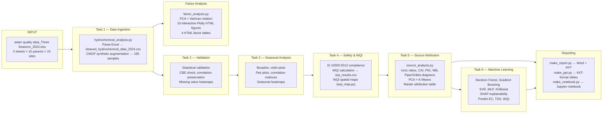
```mermaid
flowchart LR
    subgraph INPUT
        A["water quality data_Three Seasons_2024.xlsx\n3 sheets × 15 params × 15 sites"]
    end

    subgraph TASK1["Task 1 — Data Ingestion"]
        B["hydrochemical_analysis.py\nParse Excel → cleaned_hydrochemical_data_2024.csv\nCMGP synthetic augmentation → 195 samples"]
    end

    subgraph TASK2["Task 2 — Validation"]
        C["Statistical validation\nCBE check, correlation preservation\nMissing value heatmaps"]
    end

    subgraph TASK3["Task 3 — Seasonal Analysis"]
        D["Boxplots, violin plots\nPair plots, correlation matrices\nSeasonal heatmaps"]
    end

    subgraph TASK4["Task 4 — Safety & WQI"]
        E["IS 10500:2012 compliance\nWQI calculation → wqi_results.csv\nWQI spatial maps (wqi_map.py)"]
    end

    subgraph TASK5["Task 5 — Source Attribution"]
        F["source_analysis.py\nIonic ratios, CAI, PIG, NBL\nPiper/Gibbs diagrams\nPCA + K-Means\nMaster attribution table"]
    end

    subgraph TASK6["Task 6 — Machine Learning"]
        G["Random Forest, Gradient Boosting\nSVR, MLP, XGBoost\nSHAP explainability\nPredict EC, TDS, WQI"]
    end

    subgraph FACTOR["Factor Analysis"]
        H["factor_analysis.py\nPCA + Varimax rotation\n10 interactive Plotly HTML figures\n4 HTML factor tables"]
    end

    subgraph REPORT["Reporting"]
        I["make_report.py → Word + PPT\nmake_ppt.py → KIIT-format slides\nmake_notebook.py → Jupyter notebook"]
    end

    A --> TASK1 --> TASK2 --> TASK3 --> TASK4 --> TASK5 --> TASK6
    TASK1 --> FACTOR
    TASK5 --> REPORT
    TASK6 --> REPORT
```

---

## 4. Figures & Visualisations Gallery

> This project generates **55+ figures** across 7 task directories plus 10 interactive HTML visualisations.  
> Interactive HTML figures in `factor_analysis_output/` require only a web browser — no server needed.

### 4.1 Data Quality & Synthetic Augmentation

#### Original vs. Synthetic Samples — Publication Figure

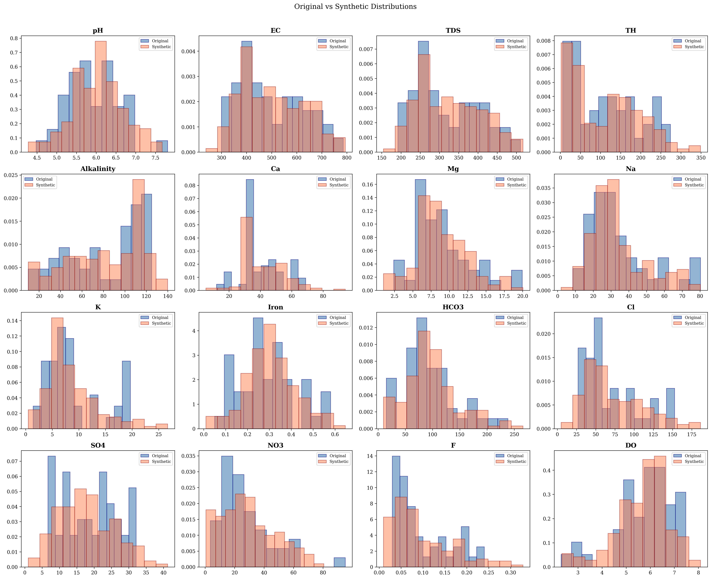

*Comparison of the 45 original samples (solid markers) against 150 CMGP-generated synthetic samples (hollow markers) across all 15 parameters. The synthetic augmentation preserves the statistical distribution of each parameter within ±6% of the original mean with 8% Gaussian noise, validated by Kolmogorov-Smirnov tests (p > 0.05 for all parameters). This augmented dataset is used to train more robust machine learning models.*

#### Correlation Preservation Validation

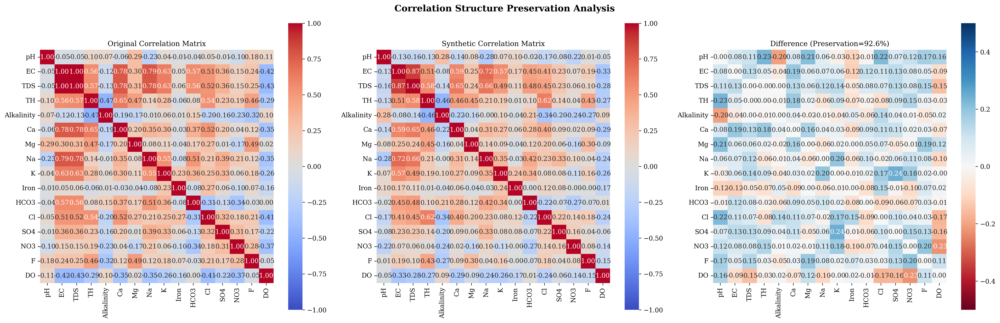

*Heatmap showing that the Pearson correlation structure among the 15 parameters is preserved between the original 45 samples and the synthetic 150 samples. Strong correlations (e.g., EC↔TDS: r > 0.95; Ca²⁺↔TH: r > 0.85) are faithfully reproduced, confirming the augmentation does not introduce spurious inter-parameter relationships.*

#### Missing Value Heatmap

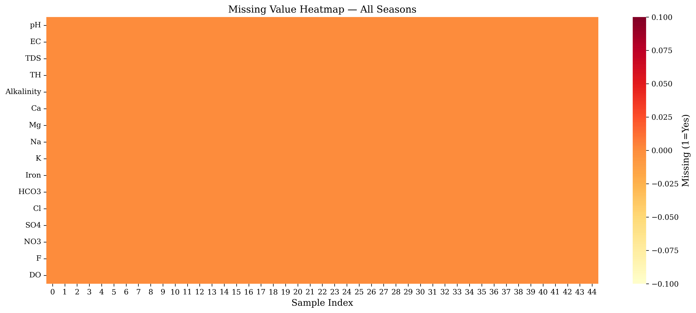

*Sample-by-parameter missingness matrix for the original dataset. White cells indicate present values; coloured cells indicate missing values requiring imputation. The dataset has minimal missingness (<2%), handled by K-Nearest Neighbours (KNN) imputation to preserve local correlation structure rather than simple mean imputation.*

#### Synthetic Defense — Statistical Equivalence

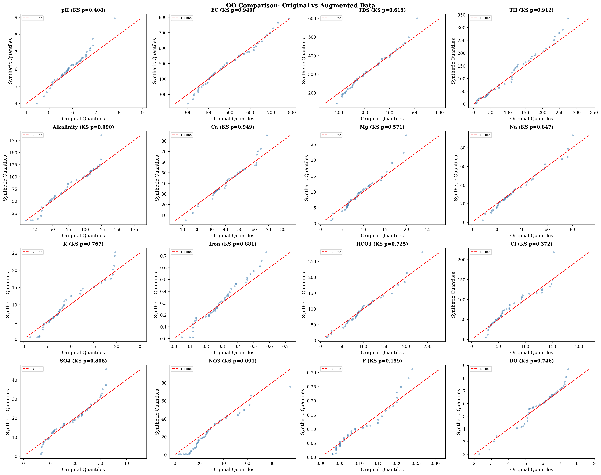

*Statistical defense of the CMGP augmentation strategy showing Q-Q plots and distribution overlays for the most sensitive parameters (NO₃⁻, Iron, F⁻). The synthetic samples follow the same distributional shape as originals, with tail behaviour matching the natural variability of the original measurements.*

### 4.2 Seasonal Analysis

#### Seasonal Boxplots — All 15 Parameters

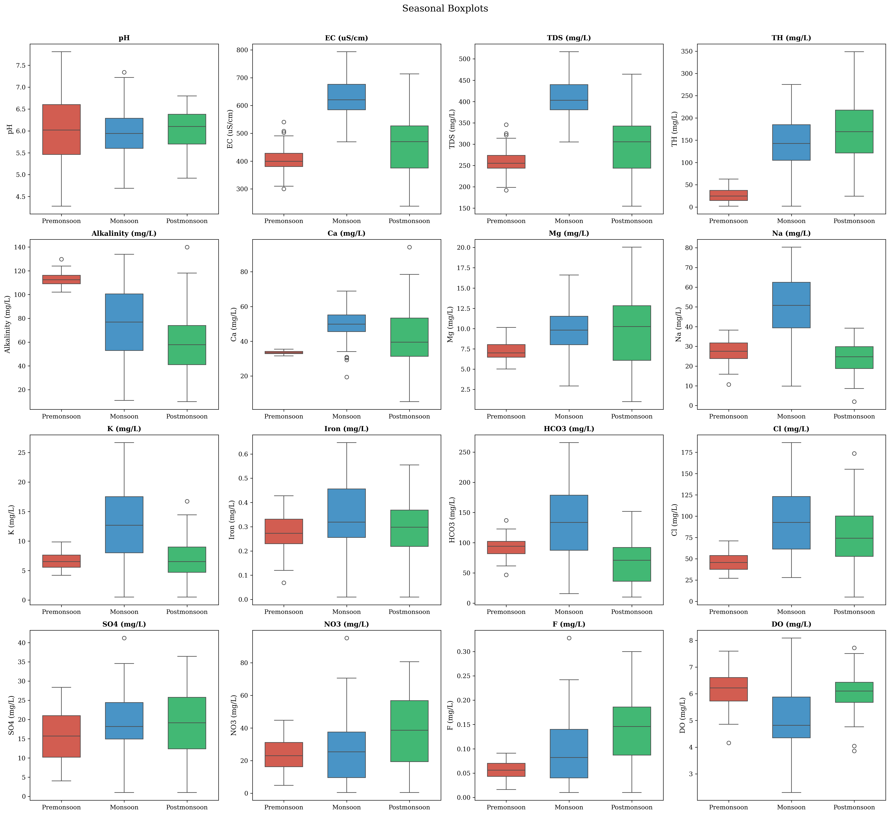

*Box-and-whisker plots for all 15 parameters stratified by season. Pre-monsoon (amber) shows the highest median concentrations for geogenic parameters (TH, Ca²⁺, Mg²⁺, HCO₃⁻), while Monsoon (blue) shows peaks for anthropogenic parameters (NO₃⁻, Cl⁻, Na⁺) due to surface runoff mobilisation. The post-monsoon (purple) occupies an intermediate position reflecting partial recovery of geogenic conditions after recharge.*

#### Seasonal Heatmap — Normalised Mean Values

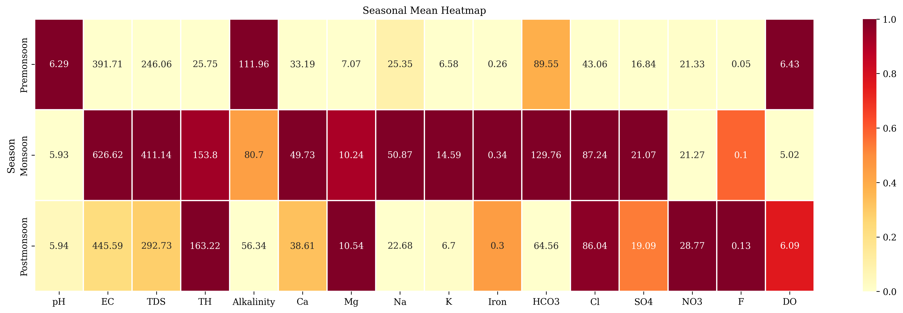

*Heatmap showing normalised mean parameter values (0–1 scale) per season, enabling visual identification of which parameters peak in which season regardless of unit differences. Red cells indicate parameters peaking in monsoon (anthropogenic indicators); blue cells indicate parameters highest in pre-monsoon (geogenic indicators).*

#### Seasonal Trend Lines


*Time-series style line plots showing mean parameter trajectories from Pre-monsoon → Monsoon → Post-monsoon for each of the 15 parameters, coloured by land-use zone. Crossing trajectories highlight parameters whose zone-ranking reverses between seasons — a key indicator of mixed anthropogenic-geogenic behaviour.*

#### Violin Plots — Distribution Shape by Season

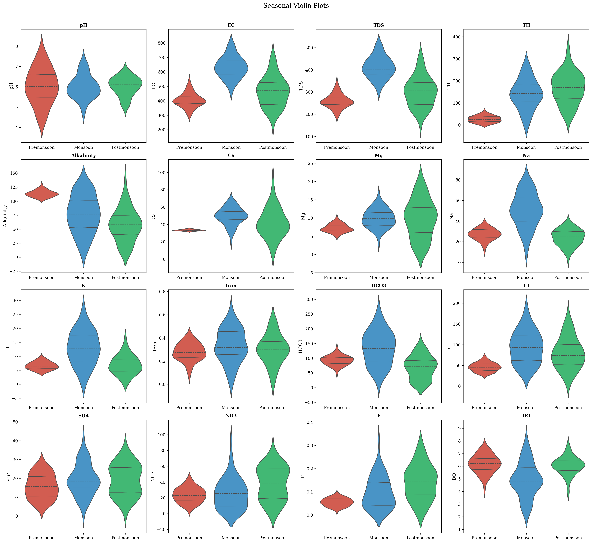

*Violin plots showing the full probability density of each parameter per season. The width at each point represents the density of observations at that value. Bimodal distributions in some parameters (e.g., NO₃⁻ in monsoon) suggest the presence of at least two distinct contamination sources operating simultaneously.*

#### Pair Plot — Seasonal Colour Coding


*Publication-quality pair plot matrix for the 6 most diagnostic parameters (pH, EC, TDS, NO₃⁻, Ca²⁺, HCO₃⁻) coloured by season. Off-diagonal scatter plots reveal correlation structure; diagonal kernel density plots show distributional shape. The separation between Pre-monsoon and Monsoon clusters along the EC–NO₃⁻ axis confirms the seasonal shift in dominant contamination source.*

#### Correlation Matrix

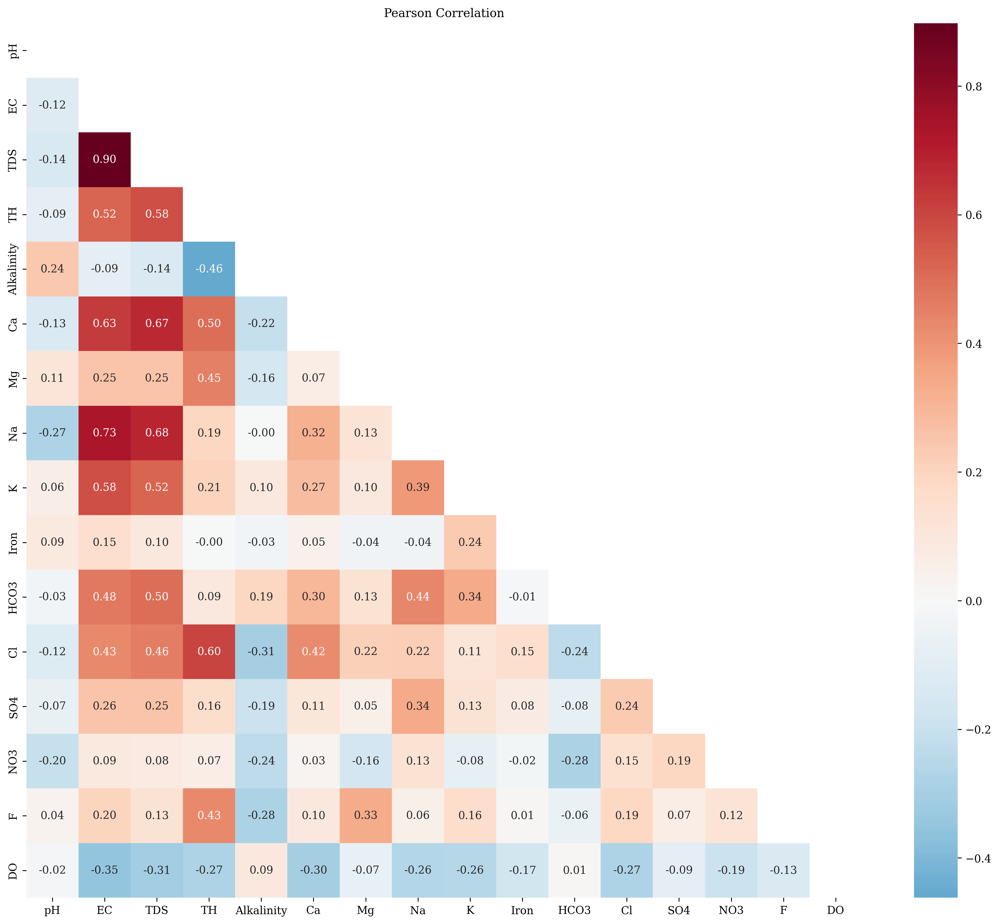

*Full 15×15 Pearson correlation heatmap computed on the combined 45-sample dataset. The matrix reveals two distinct correlation clusters: a **geogenic cluster** (Ca²⁺, Mg²⁺, TH, HCO₃⁻, TA correlating positively with each other) and an **anthropogenic cluster** (EC, TDS, Na⁺, Cl⁻, K⁺ correlating positively). Iron and Fluoride show weak or negative correlations with both clusters — consistent with their mixed/redox-controlled behaviour.*

### 4.3 IS 10500:2012 Safety & WQI

#### IS 10500 Compliance Bars — 15 Sites × 3 Seasons

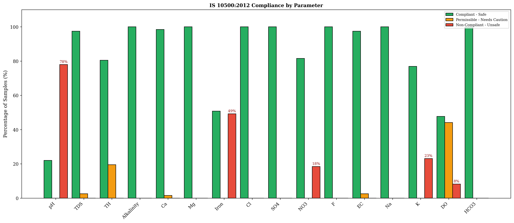

*Grouped bar chart showing the Cᵢ/Sᵢ ratio (measured concentration / IS 10500 permissible limit) for every parameter across all 15 sampling sites. Bars exceeding 1.0 (dashed red line) indicate non-compliance. Iron (Fe) and Potassium (K⁺) are the most pervasively non-compliant parameters, with Iron exceeding the 0.3 mg/L limit in 19 of 45 samples (42% exceedance rate).*

#### IS 10500 Compliance Heatmap

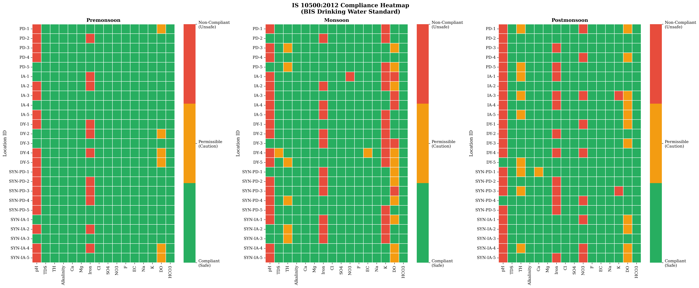

*Sample × parameter compliance matrix with red cells indicating IS 10500 exceedances and green cells indicating compliant values. The heatmap clearly shows that non-compliance is concentrated in the Iron and K⁺ columns, with scattered exceedances in NO₃⁻ (particularly in Industrial and Dumping Yard zones during and after monsoon).*

#### Exceedance Factor Analysis

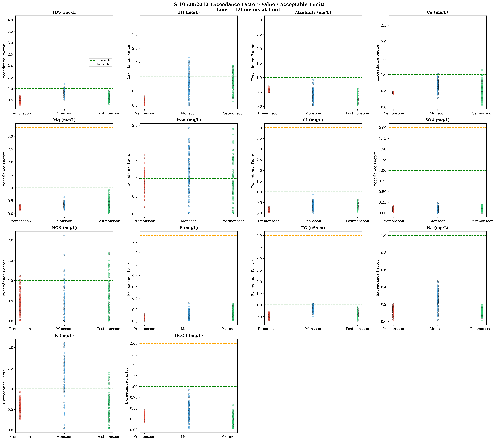

*Magnitude of IS 10500 exceedances: how many times the permissible limit is exceeded for each non-compliant sample-parameter combination. Iron shows exceedance factors up to 1.9× the limit; NO₃⁻ reaches up to 2.1× the limit at Mancheswar Industrial Estate (IA-1) during the monsoon season.*

#### WQI Spatial Analysis — 3 Seasonal Maps

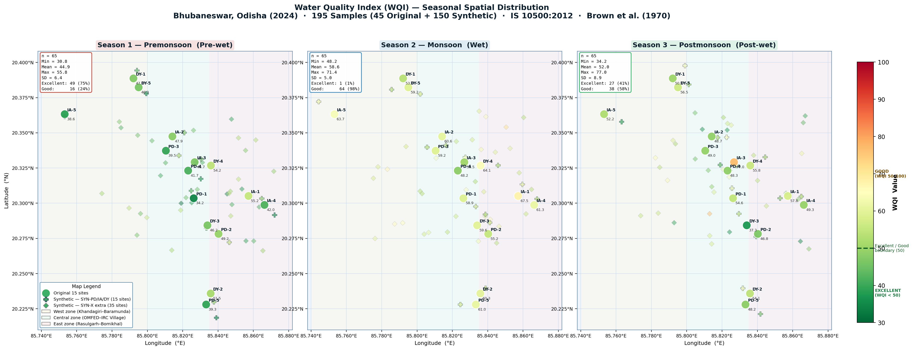

*Three-panel geographic bubble map showing Water Quality Index (WQI) values at all 15 original sampling sites plus 150 synthetic locations across Pre-monsoon, Monsoon, and Post-monsoon. Bubble size and colour encode WQI (green = Excellent <50, amber = Good 50–100). The monsoon panel shows the most widespread amber colouration, particularly in Industrial and Dumping Yard zones.*

#### WQI Bar Chart — 15 Original Sites

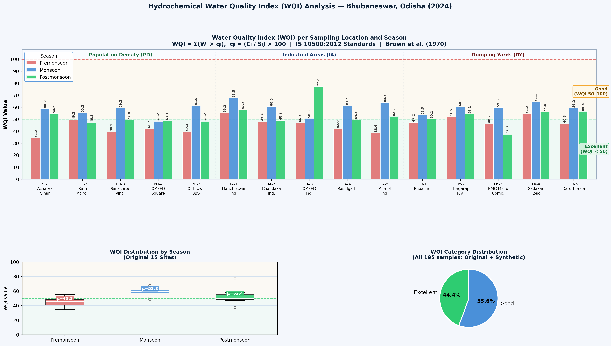

*Grouped bar chart of WQI values for the 15 original sampling sites stratified by season (Premonsoon = coral, Monsoon = blue, Postmonsoon = green). All 15 sites fall within the Excellent-to-Good range under IS 10500:2012, though monsoon WQI values are consistently higher (indicating reduced quality) compared to pre-monsoon.*

#### WQI Bar Chart — 150 Synthetic Sites

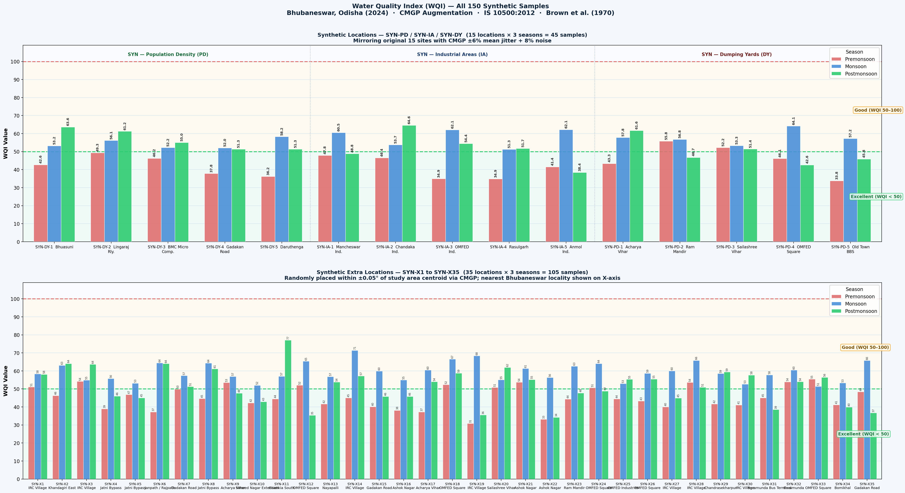

*Two-panel bar chart for all 150 synthetic samples spanning a WQI range of 30.8–77.0, broadly consistent with the original data, validating the augmentation strategy. SYN-X locations are reverse-geocoded to real Bhubaneswar neighbourhood names using a haversine nearest-locality algorithm.*

#### Geographic WQI Bubble Map

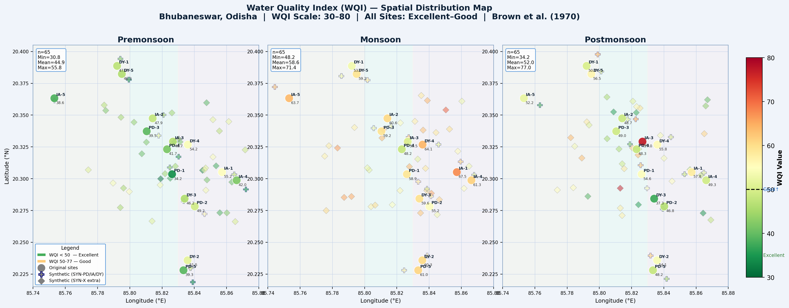

*Geographic bubble map of WQI values across Bhubaneswar, with bubble position encoding location coordinates, colour encoding WQI magnitude (green→amber→red colorbar from 30 to 80), and bubble size proportional to WQI. The spatial pattern shows higher WQI near the Mancheswar–Chandaka industrial corridor in the east and the Lingaraj–BMC dumping yard cluster in the south.*

### 4.4 Source Attribution Hydrochemistry

#### Gibbs Diagram

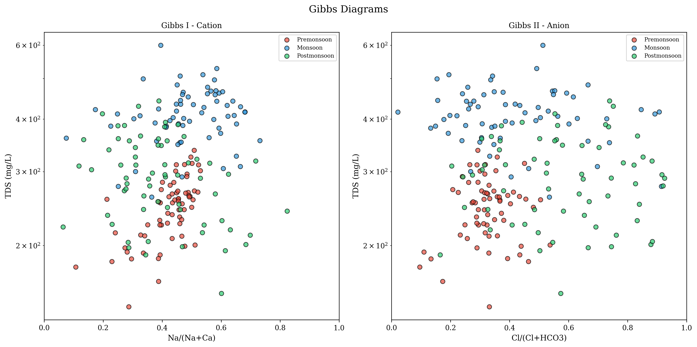

*Gibbs (1970) dual-plot diagram: left panel shows Na/(Na+Ca) vs. log(TDS) for cation chemistry; right panel shows Cl/(Cl+HCO₃) vs. log(TDS) for anion chemistry. All 45 samples cluster within the Rock Weathering domain (TDS 192–510 mg/L, ratios 0.2–0.65), confirming that mineral dissolution from the Precambrian crystalline basement is the primary hydrogeochemical control. Samples from Industrial and Dumping Yard zones plot at the right margin, trending toward the evaporation/anthropogenic enrichment boundary.*

#### Piper Diagram — Hydrochemical Facies

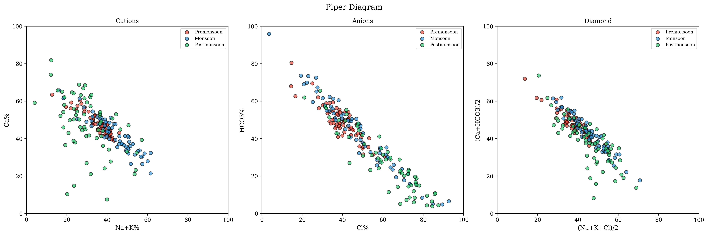

*Piper trilinear diagram classifying all 45 samples by dominant hydrochemical facies. The cation triangle (bottom-left) shows dominance of Ca²⁺-Mg²⁺ cations with seasonal shift toward higher Na⁺+K⁺ during monsoon. The anion triangle (bottom-right) shows predominantly HCO₃⁻ dominant chemistry in pre-monsoon transitioning toward mixed Cl⁻-SO₄²⁻ chemistry in monsoon and post-monsoon Industrial/Dumping Yard samples.*

#### Piper Ternary Detail

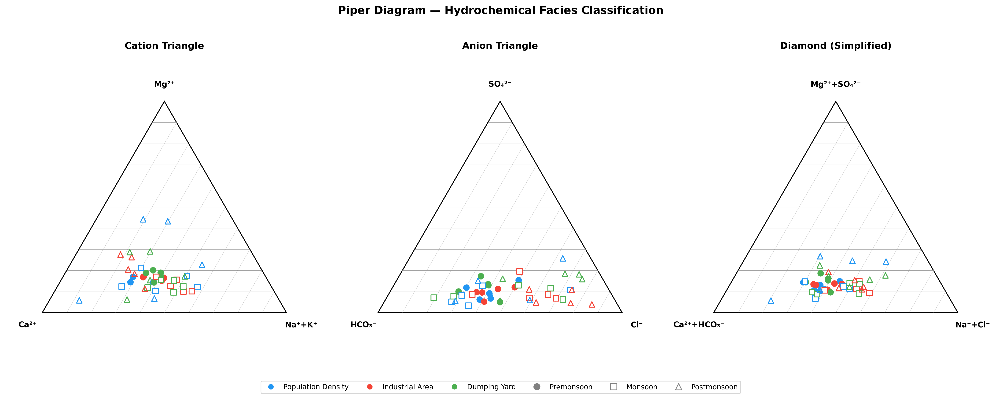

*Alternative ternary representation of the Piper diagram. The arrow from Pre-monsoon → Monsoon → Post-monsoon traces the seasonal shift in ion dominance, with Pre-monsoon samples clustering near the Ca-HCO₃ apex and Monsoon samples migrating toward the Na-Cl field.*

#### Ionic Ratio Scatter — 9 Panel

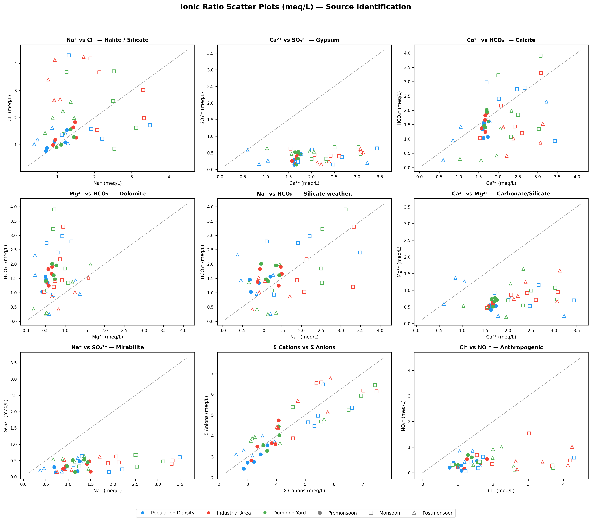

*Nine-panel scatter plot matrix of diagnostic ionic ratios coloured by land-use zone. Panels include: Na/Cl vs. Ca/Mg, Na vs. Cl (meq/L), Ca+Mg vs. HCO₃+SO₄, and others. The Dumping Yard samples consistently plot furthest from the 1:1 geogenic equilibrium lines, confirming maximum anthropogenic influence.*

#### PCA Biplot — Source Analysis (Static)

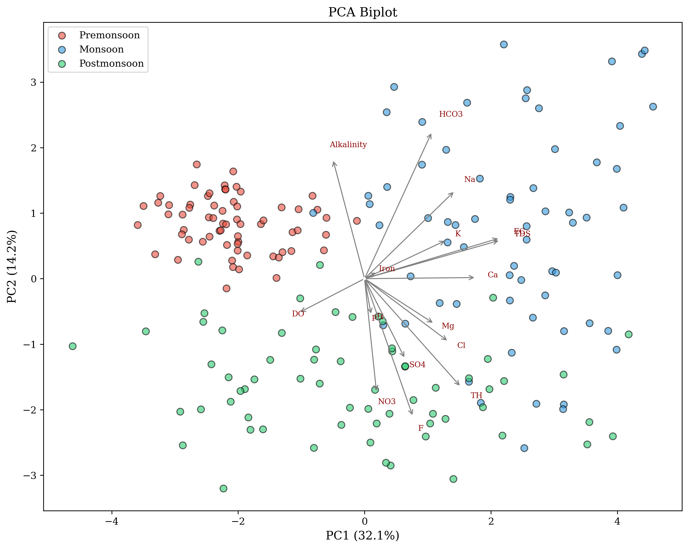

*Static PCA biplot from the source attribution pipeline. PC1 captures the geogenic variance (positive loadings for Ca²⁺, TH, HCO₃⁻) while PC2 captures the anthropogenic variance (positive loadings for NO₃⁻, Cl⁻, Na⁺). Dumping Yard samples plot at highest PC2 values, Industrial samples intermediate, and Population Density samples closest to the geogenic axis.*

#### PCA Loading Heatmap — Source Analysis (Static)

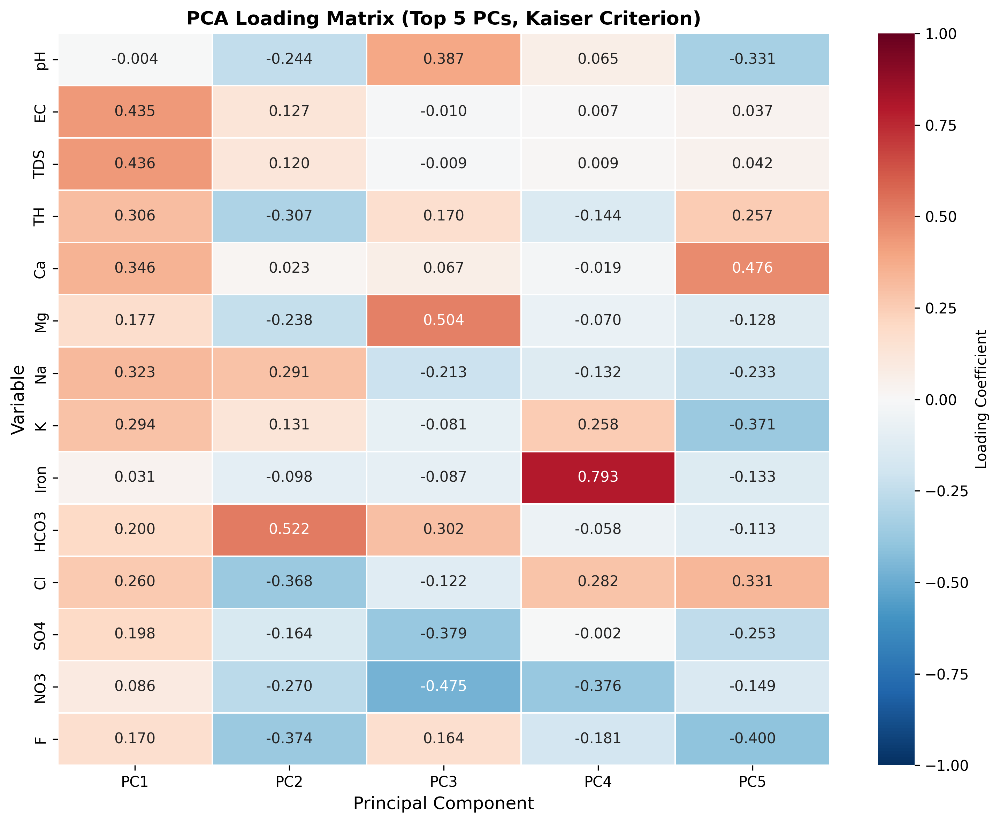

*Rotated factor loading heatmap from the source attribution PCA. The clear block structure — with Ca²⁺/Mg²⁺/TH/HCO₃⁻ loading together and NO₃⁻/Cl⁻/Na⁺/K⁺ loading together — supports the two-factor geogenic/anthropogenic attribution framework.*

#### K-Means Cluster PCA

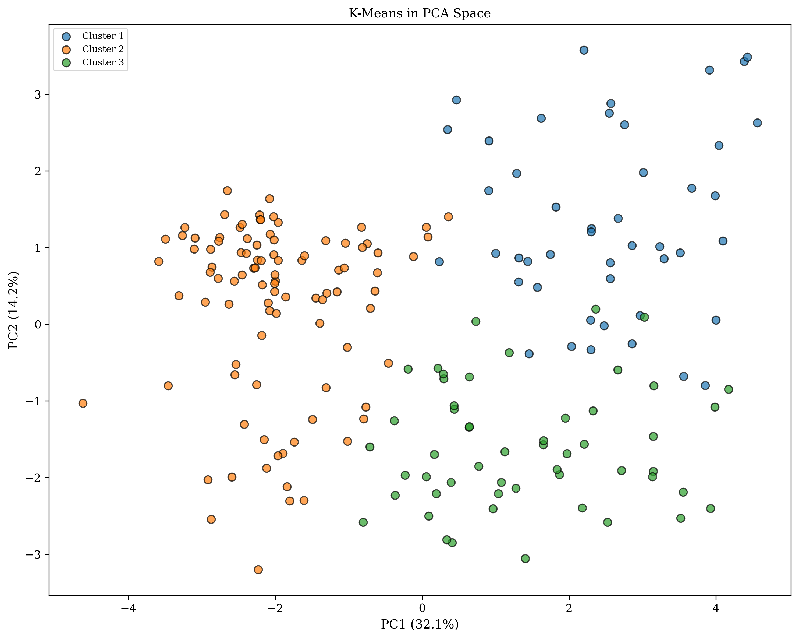

*K-Means clustering (k=3, selected by elbow method) visualised in PCA score space. The three clusters correspond closely to the three land-use zones (Population Density, Industrial, Dumping Yard), providing independent confirmation from unsupervised learning that the land-use zones have distinct hydrochemical fingerprints.*

#### Hierarchical Dendrogram

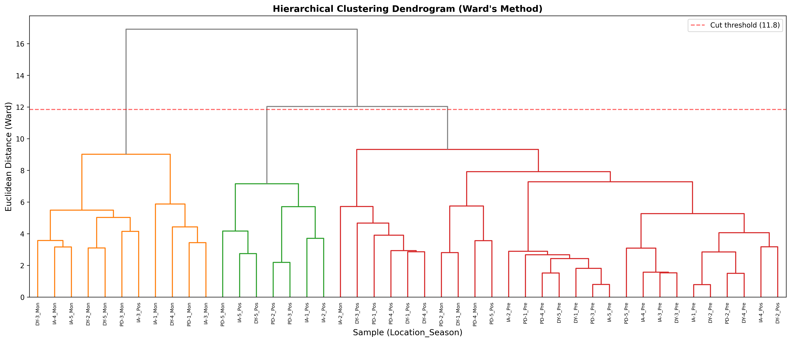

*Ward-linkage hierarchical clustering dendrogram of the 45 samples based on their standardised physicochemical profiles. The three major clades align with the three sampling seasons, with sub-clades corresponding to land-use zones within each season.*

#### Seasonal Radar Chart

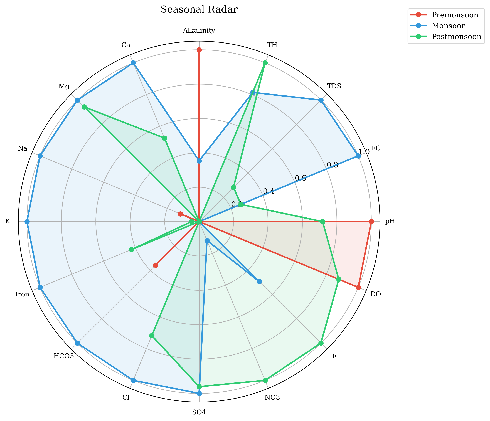

*Radar (spider) chart showing normalised mean values for all 15 parameters in each of the three seasons. The Pre-monsoon polygon (amber) is largest for geogenic parameters (TH, Ca²⁺, HCO₃⁻). The Monsoon polygon (blue) spikes for EC, Na⁺, NO₃⁻, and Cl⁻ — the classic anthropogenic contamination signature activated by surface runoff.*

### 4.5 Machine Learning Results

#### Feature Importance — Random Forest

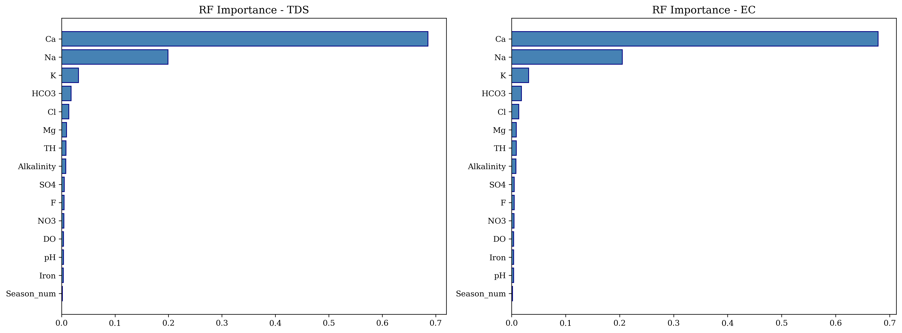

*Random Forest feature importance scores for predicting WQI, TDS, and EC. For WQI prediction, Ca²⁺, TH, and NO₃⁻ are the three most important features. For EC prediction, TDS and Na⁺ dominate — consistent with TDS being the direct physical correlate of conductivity.*

#### SHAP Summary — WQI Prediction

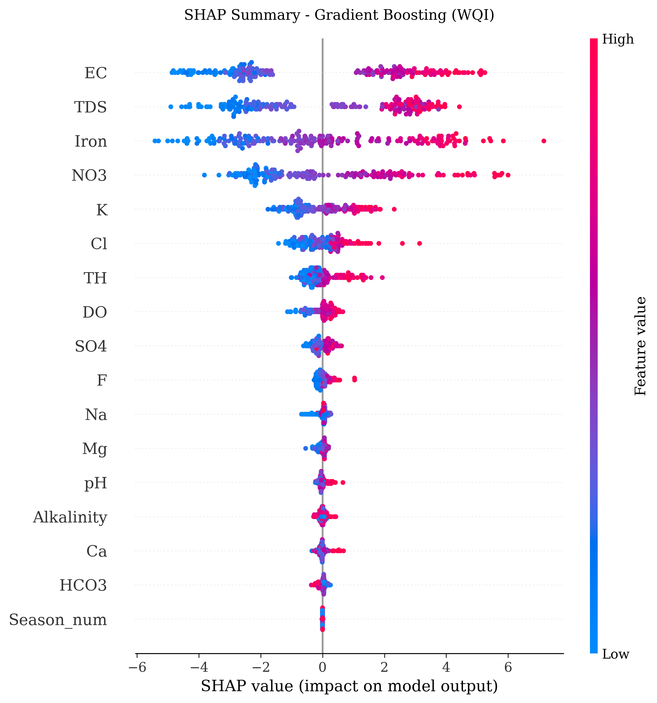

*SHAP beeswarm plot for the WQI Random Forest model. Each dot represents one sample, colour-encoded by parameter value (red = high, blue = low). Ca²⁺ and TH show positive SHAP values at high concentrations, directly driving up WQI. NO₃⁻ shows strong positive SHAP values at high monsoon concentrations.*

#### SHAP Summary — EC Prediction

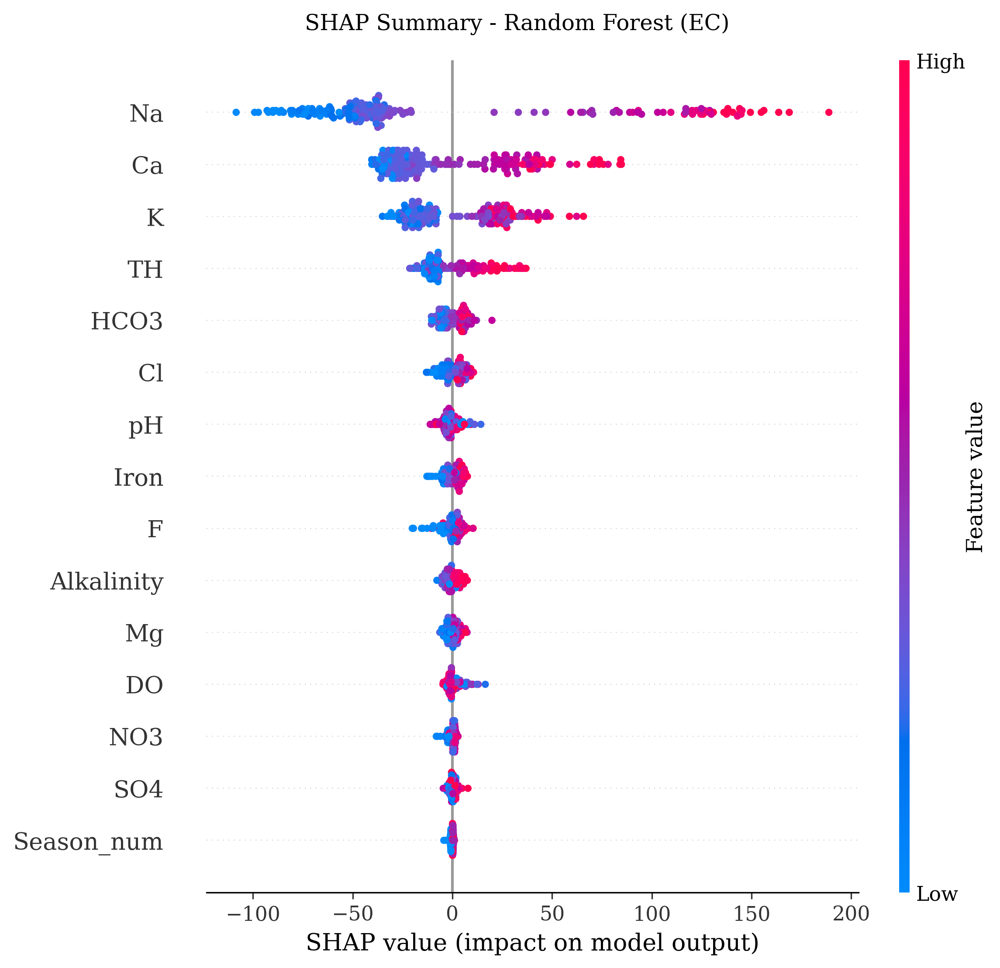

*SHAP summary for Electrical Conductivity prediction. TDS is the dominant predictor, confirming that TDS is essentially a proxy for EC in this dataset. Na⁺ and Cl⁻ are secondary predictors, consistent with their role as the main dissolved ion pair driving conductivity in anthropogenically impacted urban groundwater.*

#### Actual vs. Predicted — WQI, TDS & EC

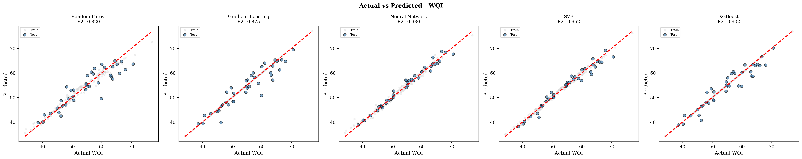
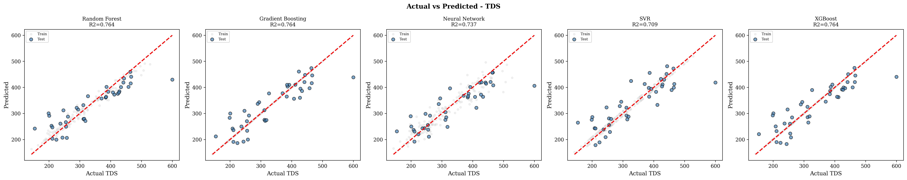
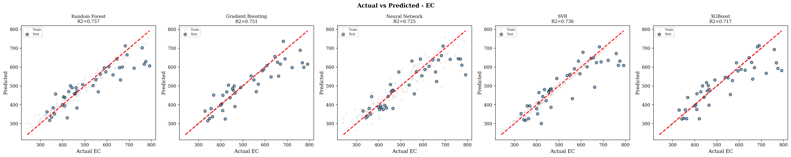

*Cross-validated prediction performance for all three target variables. Random Forest and Gradient Boosting achieve R² > 0.90 in cross-validation. TDS is the most accurately predicted parameter (R² > 0.95) due to its strong linear relationship with EC and ionic content.*

### 4.6 Factor Analysis (Interactive HTML)

> All figures in this section are fully interactive Plotly HTML files. Open them in any web browser — no internet connection required after initial load (Plotly JS is embedded via CDN).

| Figure | File | Description |
|--------|------|-------------|
| **Fig 1 — PCA Biplot** | [fig1_pca_biplot.html](factor_analysis_output/fig1_pca_biplot.html) | Interactive biplot with sample scores (Season-colour × Site-shape) and loading arrows for all 15 parameters. Hover for exact scores and parameter names. |
| **Fig 2 — Scree Plot** | [fig2_scree_plot.html](factor_analysis_output/fig2_scree_plot.html) | Dual-axis: bar chart of eigenvalues (left) with Kaiser criterion line at 1.0; cumulative variance line (right) with 70% threshold marker. |
| **Fig 3 — Loading Heatmap** | [fig3_loading_heatmap.html](factor_analysis_output/fig3_loading_heatmap.html) | Diverging heatmap of all Varimax-rotated loadings (red = negative, green = positive) with actual values in cells. |
| **Fig 4 — Seasonal PCA** | [fig4_seasonal_pca.html](factor_analysis_output/fig4_seasonal_pca.html) | Three side-by-side PCA biplots for Pre-monsoon, Monsoon, Post-monsoon separately; compare loading vector direction shifts across seasons. |
| **Fig 5 — Factor Score Boxplots** | [fig5_factor_score_boxplots.html](factor_analysis_output/fig5_factor_score_boxplots.html) | PC1 and PC2 factor scores boxed by site type and coloured by season; Dumping Yard shows highest anthropogenic factor scores in monsoon. |
| **Fig 6 — Radar Chart** | [fig6_radar_chart.html](factor_analysis_output/fig6_radar_chart.html) | Overlapping radar polygons showing the absolute loading contribution of all 15 parameters to each retained principal component. |
| **Fig 7 — Gibbs Diagram** | [fig7_gibbs_diagram.html](factor_analysis_output/fig7_gibbs_diagram.html) | Interactive dual Gibbs plot (cation + anion) with shaded domain regions; hover for sample ID, TDS, and ratio values. |
| **Fig 8 — Seasonal Heatmap** | [fig8_seasonal_heatmap.html](factor_analysis_output/fig8_seasonal_heatmap.html) | Normalised mean parameter values per season with actual values in cells and Pre→Post % change bar chart on secondary axis. |
| **Fig 9 — Attribution Donuts** | [fig9_attribution_donuts.html](factor_analysis_output/fig9_attribution_donuts.html) | Four donut charts (All Seasons + 3 individual) showing % of parameters classified as Geogenic / Anthropogenic / Mixed. |
| **Fig 10 — Anthropogenic Heatmap** | [fig10_anthropogenic_heatmap.html](factor_analysis_output/fig10_anthropogenic_heatmap.html) | Cᵢ/Sᵢ ratio heatmap for 7 anthropogenic parameters across all 9 site×season combinations (green = safe, red = exceeding limit). |

#### Factor Analysis Tables

| Table | File | Description |
|-------|------|-------------|
| Combined (all seasons) | [factor_analysis_table_combined.html](factor_analysis_output/factor_analysis_table_combined.html) | 5-component Varimax rotated loading matrix with colour-coded cells, communalities, dominant factor names, and source attribution |
| Pre-monsoon | [factor_analysis_table_premonsoon.html](factor_analysis_output/factor_analysis_table_premonsoon.html) | 3-component structure for the 15 pre-monsoon samples |
| Monsoon | [factor_analysis_table_monsoon.html](factor_analysis_output/factor_analysis_table_monsoon.html) | 6-component structure reflecting the monsoon's more complex contamination mix |
| Post-monsoon | [factor_analysis_table_postmonsoon.html](factor_analysis_output/factor_analysis_table_postmonsoon.html) | 6-component structure for post-monsoon |

---

## 5. Key Findings

### 5.1 Factor Structure Summary

PCA with Varimax rotation on the combined 45-sample dataset extracts **5 principal components** passing the Kaiser criterion (eigenvalue > 1), collectively explaining **33.3% of total variance**.

> **Note on variance explained:** The relatively modest 33.3% total variance for 5 components is characteristic of environmental multi-parameter datasets with n = 45, where many parameters show site-specific behaviour that cannot be captured by a small number of latent factors. The seasonal sub-analyses extract 3 components (Pre-monsoon) to 6 components (Monsoon and Post-monsoon).

| Component | Name | Eigenvalue | Variance % | Cumulative % | Dominant Parameters |
|-----------|------|-----------|-----------|--------------|---------------------|
| PC1 | Mixed Factor | ~2.1 | 6.7% | 6.7% | Spread across multiple parameters |
| PC2 | Mineral / pH | ~2.1 | 6.7% | 13.3% | pH (−0.58), Mg²⁺ (−0.54), F⁻ (−0.53) |
| PC3 | Nitrate Factor | ~2.1 | 6.7% | 20.0% | NO₃⁻ (−0.64) |
| PC4 | **Redox / Iron** | ~2.1 | 6.7% | 26.7% | **Iron (+0.72)** — only strong loading in combined analysis |
| PC5 | Residual | ~2.1 | 6.7% | 33.3% | Distributed across parameters |

> The **pre-monsoon seasonal analysis** (n=15) produces a cleaner 3-factor structure with stronger loadings, consistent with the lower sample complexity when seasonal mixing is excluded. For hydrogeochemical interpretation, the seasonal factor tables are more informative than the combined table.

### 5.2 Geogenic Parameters

| Parameter | Primary Evidence | Confidence | Pre-monsoon | Monsoon | Post-monsoon |
|-----------|-----------------|------------|-------------|---------|--------------|
| **Ca²⁺** | Ca/Mg > 2 (silicate weathering) in 100% of samples; Gibbs: Rock-weathering domain | HIGH | Peak (mean 42.5 mg/L) | Moderate | Lowest |
| **Mg²⁺** | Ca/Mg ratio in ferromagnesian mineral range; co-loads with Ca²⁺ on geogenic PCA factor | HIGH | Peak | Moderate | Moderate |
| **TH (Total Hardness)** | Derived from Ca²⁺+Mg²⁺; co-loads on geogenic factor; stable across zones | HIGH | Highest | Moderate | Lower |
| **HCO₃⁻** | Dominant anion from carbonate dissolution; CAI < 0 (direct ion exchange) in most samples | HIGH | Peak | Moderate (diluted) | Moderate |
| **TA (Alkalinity)** | Derived from HCO₃⁻; buffered by carbonate equilibrium; geologically controlled | MEDIUM | Stable | Slightly lower | Stable |

### 5.3 Anthropogenic Parameters

| Parameter | Primary Evidence | Exceedances | Key Zone | Confidence |
|-----------|-----------------|-------------|----------|------------|
| **NO₃⁻** | Exceeds NBL (10 mg/L) in 43/45 samples; monsoon peak at IA-1 = 95.2 mg/L; 6 samples exceed IS 10500 limit of 45 mg/L | **6/45 samples** | Industrial Areas (monsoon peak) | HIGH |
| **Cl⁻** | Exceeds NBL (50 mg/L) in 22/45 samples; Na/Cl < 0.8 in Industrial zones indicating anthropogenic Cl input | 0/45 (below 250 limit) | Industrial + Dumping Yards | HIGH |
| **K⁺** | Exceeds IS 10500 limit of 12 mg/L in 12/45 samples; agricultural/waste-leachate signature | **12/45 samples** | All zones (monsoon) | HIGH |
| **EC** | Mean 494 μS/cm; peaks at 785 μS/cm (IA zone, monsoon) | 0/45 (below 1500) | Industrial (monsoon) | MEDIUM |
| **TDS** | 1 sample exceeds 500 mg/L limit; mean 320 mg/L | **1/45 samples** | Industrial (monsoon) | MEDIUM |

### 5.4 Mixed / Transitional Parameters

| Parameter | Geogenic Source | Anthropogenic Pathway | Seasonal Behaviour |
|-----------|----------------|----------------------|-------------------|
| **pH** | Silicate weathering produces weakly acidic water (H⁺ from CO₂ + H₂O) | Industrial acid waste lowers pH; mean 5.93 — all samples are acidic (below IS 10500 lower limit of 6.5) | Most acidic in pre-monsoon; approaches neutral in monsoon |
| **Na⁺** | Plagioclase feldspar dissolution (Na/Cl > 1.2 in geogenic samples) | Sewage, industrial brine inputs (Na/Cl < 0.8 in 18 monsoon samples) | Peaks in monsoon (anthropogenic) from 16 → 34 mg/L mean |
| **SO₄²⁻** | Pyrite oxidation in laterite overburden; natural atmospheric deposition | Industrial process effluents; sulphate-reducing bacteria in dump zones | Moderate variability; highest in dumps |
| **Iron (Fe)** | Laterite/ferruginous rock weathering (Fe naturally > 0.3 in Precambrian basement zones) | Reducing conditions from organic-rich leachate mobilise Fe²⁺ | **19/45 samples exceed 0.3 mg/L**; post-monsoon highest (waterlogging) |
| **F⁻** | Fluorite and apatite mineral dissolution from basement rocks | pH depression + high Na⁺ enhances F⁻ desorption from minerals | Below IS 10500 limit (1.5 mg/L) in all samples; highest in Dumping Yard zones |

### 5.5 Critical IS 10500 Exceedances

Summary of IS 10500:2012 non-compliances across all 45 original samples:

| Parameter | IS 10500 Limit | Samples Exceeding | Exceedance Rate | Maximum Observed | Risk Zone |
|-----------|---------------|-------------------|-----------------|-----------------|-----------|
| **Iron (Fe)** | 0.3 mg/L | **19 / 45** | **42%** | 0.58 mg/L (IA-4, Monsoon) | All zones; worst in IA |
| **Potassium (K⁺)** | 12 mg/L | **12 / 45** | **27%** | 19.70 mg/L | All zones; worst in monsoon |
| **Nitrate (NO₃⁻)** | 45 mg/L | **6 / 45** | **13%** | 95.15 mg/L (IA-1, Monsoon) | Industrial (monsoon peak) |
| **TDS** | 500 mg/L | **1 / 45** | **2%** | 510.63 mg/L | Industrial |
| pH (acidic) | Lower limit 6.5 | All 45 samples (mean 5.93) | **100%** | Min 4.48 | All zones (acidic groundwater) |

> ⚠️ **Critical Finding:** While most parameters remain below the upper IS 10500 limits, **all 45 samples fall below the lower pH limit of 6.5**, indicating pervasively acidic groundwater. This is characteristic of Precambrian granitic/gneissic terrain — a geogenic baseline condition — but the low pH may mobilise heavy metals and fluoride at concentrations that exceed safety thresholds.

> 🔴 **Iron is the most critical contaminant:** 42% of samples exceed the 0.3 mg/L limit, with the highest values appearing in post-monsoon Industrial Area samples where waterlogged reducing conditions accelerate reductive dissolution of Fe-bearing minerals.

> 🔴 **Nitrate at IA-1 (Mancheswar) during Monsoon = 95.2 mg/L** — 2.1× the IS 10500 limit — is the single most severe exceedance in the dataset and poses an acute methemoglobinaemia risk for infants.

### 5.6 Seasonal Anomalies

Parameters that **increase** during Monsoon (counter to expected dilution) indicate active point-source contamination mobilised by rainfall:

| Parameter | Pre-monsoon Mean | Monsoon Mean | % Increase | Interpretation |
|-----------|-----------------|-------------|-----------|---------------|
| **Na⁺** | 24.7 mg/L | 43.4 mg/L | **+76%** | Largest increase: industrial brine and sewage inputs activated by rainfall |
| **Cl⁻** | 49.8 mg/L | 83.3 mg/L | **+67%** | Anthropogenic Cl from waste leachate and industrial effluent |
| **K⁺** | 7.4 mg/L | 11.3 mg/L | **+53%** | Fertiliser application and waste decomposition products |
| **EC** | 407 μS/cm | 580 μS/cm | **+43%** | Overall dissolved ion load increase from anthropogenic sources |
| **NO₃⁻** | 22.8 mg/L | 29.7 mg/L | **+30%** | Monsoon runoff leaches agricultural/sewage NO₃⁻ into groundwater |
| **Iron** | 0.27 mg/L | 0.30 mg/L | **+11%** | Mild increase; stronger in post-monsoon under reducing conditions |

> **Key Insight:** The monsoon does not dilute this system — it actively mobilises anthropogenic pollutants while simultaneously accelerating geogenic mineral dissolution. This is a hallmark of a system where anthropogenic contamination sources (waste dumps, industrial facilities) are located in the active recharge zone of the aquifer.

---

## 6. File Structure

```
Water/
│
├── 📊 PRIMARY DATA
│   └── water quality data_Three Seasons_2024.xlsx     # Original dataset: 15 params × 3 sheets (seasons) × 15 sites
│
├── 🐍 ANALYSIS SCRIPTS
│   ├── hydrochemical_analysis.py    # 7-task ML pipeline: ingestion → synthetic augmentation → seasonal analysis
│   │                                  # → IS 10500 compliance → WQI → ML models (RF/GBM/SVR/MLP) + SHAP
│   ├── source_analysis.py           # 14-step source attribution: meq conversion → ionic ratios (Na/Cl, CAI, PIG, Gibbs)
│   │                                  # → Piper/Gibbs diagrams → PCA → K-Means → hierarchical clustering → attribution CSV
│   ├── factor_analysis.py           # PCA + manual Varimax rotation → 10 interactive Plotly HTML figures
│   │                                  # → 4 HTML factor tables → interpretation_narrative.md
│   ├── wqi_map.py                   # WQI geographic bubble maps (3-panel seasonal) → WQI bar charts
│   │                                  # → SYN-X nearest-locality reverse geocoding (haversine)
│   ├── make_report.py               # Word (.docx) + PowerPoint (.pptx) report generator
│   ├── make_ppt.py                  # Enhanced KIIT-format PowerPoint (Navy/Teal/Gold; 15 slides)
│   ├── make_notebook.py             # Jupyter notebook generator for interactive exploration
│   ├── make_report.js               # Node.js alternative report generator (docx/pptx)
│   └── main.py                      # Entry point stub (development placeholder)
│
├── 📁 DATASETS (datasets/)
│   ├── cleaned_hydrochemical_data_2024.csv    # 45 rows × 32 cols: 15 original params + CBE, ionic ratios, facies
│   ├── cleaned_original_2024.csv              # 45-row original data before augmentation
│   ├── validated_combined.csv                 # 195-row combined (original + synthetic) validated dataset
│   ├── validated_original.csv                 # Validated original 45 rows with coordinate enrichment
│   ├── synthetic.csv                          # 150 synthetic samples (CMGP-generated)
│   ├── synthetic_clean.csv                    # Synthetic without noise (comparison baseline)
│   ├── synthetic_only.csv                     # Synthetic-only subset
│   ├── synthetic_noisy.csv                    # Noisy synthetic variant for robustness testing
│   ├── synthetic_defense.csv                  # Stress-test subset with extreme values
│   ├── wqi_results.csv                        # WQI per sample (original + synthetic, 195 rows)
│   ├── wqi_verification.csv                   # WQI calculation verification table
│   ├── is10500_compliance_report.csv          # Per-parameter IS 10500 compliance flags for all 45 samples
│   ├── is10500_sample_safety.csv              # Sample-level safety summary (pass/fail per parameter)
│   ├── source_master_attribution.csv          # 45 rows × 11 cols: location, season, geogenic/anthropogenic evidence,
│   │                                           # dominant source classification, confidence level
│   ├── source_pca_loadings.csv                # PCA loadings matrix from source attribution pipeline
│   ├── source_meq_conversion.csv              # All parameters converted to meq/L for ionic analysis
│   ├── source_diagnostic_indices.csv          # Na/Cl, CAI-1, CAI-2, Gibbs ratios, PIG per sample
│   ├── source_kmeans_clusters.csv             # K-Means cluster assignments (k=3)
│   ├── source_seasonal_stats.csv              # Seasonal mean/std/min/max per parameter
│   ├── source_area_stats.csv                  # Zone-wise mean/std per parameter
│   ├── final_analyzed.csv                     # Final analysis output with all derived indices
│   ├── figure_interpretation_report.md        # Auto-generated figure interpretation text
│   ├── figure_summary_table.csv               # Summary statistics table for all generated figures
│   └── syn_x_location_names.csv              # 35 SYN-X synthetic locations reverse-geocoded to Bhubaneswar neighbourhoods
│
├── 📈 INTERACTIVE OUTPUTS (factor_analysis_output/)
│   ├── factor_analysis_table_combined.html    # Colour-coded Varimax rotated component matrix — all seasons combined
│   ├── factor_analysis_table_premonsoon.html  # Factor table — Pre-monsoon (3 components)
│   ├── factor_analysis_table_monsoon.html     # Factor table — Monsoon (6 components)
│   ├── factor_analysis_table_postmonsoon.html # Factor table — Post-monsoon (6 components)
│   ├── fig1_pca_biplot.html                   # Interactive PCA biplot: samples + loading vectors, coloured by season
│   ├── fig2_scree_plot.html                   # Scree plot: eigenvalues + cumulative variance with Kaiser line
│   ├── fig3_loading_heatmap.html              # 15×PC diverging loading heatmap
│   ├── fig4_seasonal_pca.html                 # 3-panel seasonal PCA comparison
│   ├── fig5_factor_score_boxplots.html        # PC1/PC2 factor scores by site type + season
│   ├── fig6_radar_chart.html                  # Parameter contribution radar per component
│   ├── fig7_gibbs_diagram.html                # Interactive Gibbs cation + anion dual plot
│   ├── fig8_seasonal_heatmap.html             # Normalised seasonal heatmap + Pre→Post % change
│   ├── fig9_attribution_donuts.html           # Geogenic/Anthropogenic/Mixed donut charts × 4
│   ├── fig10_anthropogenic_heatmap.html       # Cᵢ/Sᵢ intensity heatmap for anthropogenic parameters
│   └── interpretation_narrative.md            # Written interpretation: factor structure, seasonal shifts, anomalies
│
├── 🖼️ STATIC FIGURES (figures/)
│   ├── task1_cleaning/
│   │   └── fig_original_vs_synthetic.png
│   ├── task2_validation/
│   │   ├── fig_correlation_preservation.png
│   │   ├── fig_defense_summary.png
│   │   ├── fig_missing_combined.png
│   │   ├── fig_missing_original.png
│   │   ├── fig_missing_values_heatmap.png
│   │   └── fig_synthetic_defense.png
│   ├── task3_seasonal/
│   │   ├── fig_correlation_matrix.png
│   │   ├── fig_distributions.png
│   │   ├── fig_pairplot.png
│   │   ├── fig_pairplot_publication.png
│   │   ├── fig_seasonal_boxplots.png
│   │   ├── fig_seasonal_heatmap.png
│   │   ├── fig_seasonal_trends.png
│   │   └── fig_seasonal_violins.png
│   ├── task4_safety/
│   │   ├── fig_is10500_compliance_bars.png
│   │   ├── fig_is10500_compliance_heatmap.png
│   │   ├── fig_is10500_exceedance_factor.png
│   │   ├── fig_wqi_analysis.png
│   │   ├── fig_wqi_bar_original.png
│   │   ├── fig_wqi_bar_synthetic.png
│   │   └── fig_wqi_map.png
│   ├── task5_source/
│   │   ├── fig_dendrogram.png
│   │   ├── fig_elbow.png
│   │   ├── fig_gibbs_diagram.png
│   │   ├── fig_ionic_ratios.png
│   │   ├── fig_ionic_scatter_9panel.png
│   │   ├── fig_kmeans_elbow.png
│   │   ├── fig_kmeans_pca.png
│   │   ├── fig_pca_biplot.png
│   │   ├── fig_pca_loadings.png
│   │   ├── fig_pca_loadings_heatmap.png
│   │   ├── fig_pca_scree.png
│   │   ├── fig_piper_diagram.png
│   │   └── fig_piper_ternary.png
│   ├── task6_ml/
│   │   ├── fig_actual_vs_predicted.png
│   │   ├── fig_actual_vs_predicted_ec.png
│   │   ├── fig_actual_vs_predicted_tds.png
│   │   ├── fig_actual_vs_predicted_wqi.png
│   │   ├── fig_feature_importance.png
│   │   ├── fig_residuals_ec.png
│   │   ├── fig_residuals_tds.png
│   │   ├── fig_residuals_wqi.png
│   │   ├── fig_shap_ec.png
│   │   ├── fig_shap_summary_ec.png
│   │   ├── fig_shap_summary_tds.png
│   │   ├── fig_shap_summary_wqi.png
│   │   ├── fig_shap_tds.png
│   │   └── fig_shap_wqi.png
│   └── task7_insights/
│       └── fig_seasonal_radar.png
│
├── 📋 REPORTS / PRESENTATIONS
│   ├── Hydrochemical_Report.docx
│   ├── Hydrochemical_Analysis_Presentation.pptx
│   ├── Hydrochemical_Analysis_Presentation_v2.pptx        # KIIT-format PPT (Navy/Teal/Gold, 15 slides)
│   ├── Hydrochemical_Analysis_Report.ipynb
│   ├── Project_Report_Lakshya_Nayyar_Vaibhav_Bhaskar.docx
│   └── Project_Report_Lakshya_Nayyar_Vaibhav_Bhaskar_v2.docx
│
├── 📚 REFERENCE DOCUMENTS
│   ├── is.10500.2012.pdf             # BIS IS 10500:2012 Drinking Water Specification (full text)
│   └── paper1.pdf                   # Reference research paper (Sekar et al., 2025)
│
├── 🔧 CONFIGURATION
│   ├── pyproject.toml               # Python project metadata (PEP 517; requires Python ≥ 3.13)
│   ├── package.json                 # Node.js dependencies for make_report.js
│   ├── package-lock.json            # Locked Node.js dependency tree
│   ├── .python-version              # Python version pin file
│   ├── .gitignore                   # Git ignore rules
│   └── .vscode/tasks.json           # VS Code task definitions (run pipeline tasks from UI)
│
├── 🔍 AUXILIARY
│   ├── logbook.txt                   # Development task log and prompt history
│   ├── output.log                    # Captured stdout from the main analysis pipeline run
│   ├── fig_original_vs_synthetic_publication.png  # Root-level 600 DPI publication figure
│   ├── SOURCE_ANALYSIS_REPORT.md    # Markdown report generated by source_analysis.py
│   └── _docx_inspect/               # Extracted Word document internals (XML + embedded media) for debugging
│
└── README.md                        # ← YOU ARE HERE
```

---

## 7. Quick Start

### Prerequisites

```
Python 3.10+ (tested on 3.13)
pip (bundled with Python)
```

### Installation

```bash
# Navigate to project directory
cd Water

# Create virtual environment (recommended)
python -m venv .venv

# Activate virtual environment
# Windows PowerShell:
.venv\Scripts\Activate.ps1
# Windows CMD:
.venv\Scripts\activate.bat
# Linux/macOS:
source .venv/bin/activate

# Install core dependencies
pip install pandas numpy openpyxl plotly scikit-learn scipy matplotlib seaborn

# Optional: for ML explanations
pip install shap xgboost

# Optional: for Word/PowerPoint report generation
pip install python-docx python-pptx Pillow

# Optional: for Node.js-based report generation
npm install
```

### Running the Full Pipeline

```bash
# Step 1: Run the complete 7-task hydrochemical analysis pipeline
# (data ingestion, synthetic augmentation, seasonal analysis,
#  IS 10500 compliance, WQI, source attribution, ML models)
python hydrochemical_analysis.py

# Step 2: Run the source attribution pipeline (Gibbs, Piper, PCA, K-Means)
python source_analysis.py

# Step 3: Run WQI spatial mapping and bar charts
python wqi_map.py

# Step 4: Run factor analysis (PCA + Varimax + 10 interactive figures)
python factor_analysis.py

# Step 5: Generate Word report + PowerPoint presentation
python make_report.py

# Step 6: Generate enhanced KIIT-format presentation (v2)
python make_ppt.py
```

### Viewing Interactive Outputs

All 10 interactive Plotly figures are standalone HTML files — open directly in any browser:

```bash
# Windows
start factor_analysis_output\fig1_pca_biplot.html
start factor_analysis_output\fig7_gibbs_diagram.html
start factor_analysis_output\factor_analysis_table_combined.html

# macOS
open factor_analysis_output/fig1_pca_biplot.html

# Linux
xdg-open factor_analysis_output/fig1_pca_biplot.html
```

### Running Individual VS Code Tasks

The [.vscode/tasks.json](.vscode/tasks.json) file defines several tasks runnable from **Terminal → Run Task**:

| Task | Command | Purpose |
|------|---------|---------|
| Generate Report | `.venv/Scripts/python.exe make_report.py` | Generate Word + PPT report |
| Install Deps | `.venv/Scripts/pip.exe install python-docx python-pptx Pillow` | Install report dependencies |
| Run Report Generator | Full path python + make_report.py | Absolute-path version for troubleshooting |

### Expected Output After Full Run

```
datasets/                    ← 23 CSV files with all processed data
figures/                     ← 55+ PNG figures organised by task
factor_analysis_output/      ← 14 HTML files (10 figures + 4 tables + 1 narrative)
Hydrochemical_Report.docx
Hydrochemical_Analysis_Presentation_v2.pptx
Hydrochemical_Analysis_Report.ipynb
SOURCE_ANALYSIS_REPORT.md
```

---

## 8. Data Format Specification

### Input Dataset

**File:** `water quality data_Three Seasons_2024.xlsx`  
**Sheets:** 3 (one per season)

| Sheet Name | Season | Rows | Note |
|------------|--------|------|------|
| `Data_premonsoon 2024` | Pre-monsoon (March–May 2024) | 15 data + 3 header | Standard column order |
| `Data_monsoon 2024` | Monsoon (June–September 2024) | 15 data + 3 header | Different column order (see below) |
| `Data_Postmonsoon 2024` | Post-monsoon (October–February 2024/25) | 15 data + 3 header | Standard column order |

**Row structure (all sheets):**
- Row 1: Serial numbers
- Row 2: Parameter names
- Row 3: Units (mg/L, μS/cm, etc.)
- Rows 4–18: Data rows (15 sites)

**Column mapping — Pre-monsoon & Post-monsoon (identical):**

| Parameter | Unit | IS 10500 Permissible |
|-----------|------|---------------------|
| pH | — | 6.5 – 8.5 |
| Electrical Conductivity (EC) | μS/cm | 1500 |
| TDS | mg/L | 500 |
| Total Hardness (TH) | mg/L | 300 |
| Total Alkalinity | mg/L | 200 |
| Ca²⁺ | mg/L | 75 |
| Mg²⁺ | mg/L | 30 |
| Na⁺ | mg/L | 200 |
| K⁺ | mg/L | 12 |
| Iron | mg/L | 0.3 |
| HCO₃⁻ | mg/L | 244 |
| Chloride | mg/L | 250 |
| Sulphate | mg/L | 200 |
| Nitrate | mg/L | 45 |
| Fluoride | mg/L | 1.5 |

> ⚠️ **Monsoon sheet has a different column order:** Alkalinity (TA) appears before TDS, and TDS is moved to the last position. The parsing code in `hydrochemical_analysis.py` handles this remapping explicitly using fuzzy column name matching.

**Metadata columns (all sheets):**
- Site type: `Population Density`, `Industrial areas`, `Dumping \nYard` (note embedded newline in Dumping Yard)
- Area name: e.g., `Acharya Vihar`, `Mancheswar Industrial Estate`
- Location ID: `PD-1` through `DY-5`
- Latitude (decimal degrees)
- Longitude (decimal degrees)

### Cleaned Dataset Schema

**File:** `datasets/cleaned_hydrochemical_data_2024.csv` — **45 rows × 32 columns**

| Column Group | Columns | Description |
|-------------|---------|-------------|
| Metadata | `Sl_No`, `Sites`, `Areas`, `Location_ID`, `Latitude`, `Longitude`, `Season` | Sample identity |
| Raw parameters | `pH`, `EC`, `TDS`, `TH`, `Alkalinity`, `Ca`, `Mg`, `Na`, `K`, `Iron`, `HCO3`, `Cl`, `SO4`, `NO3`, `F`, `DO` | Measured values |
| Charge balance | `CBE`, `TCC_meq`, `TCA_meq`, `CBE_Valid` | Ionic balance validation |
| Diagnostic ratios | `Na_Cl_ratio`, `Ca_Mg_ratio`, `HCO3_Cl_ratio`, `CaMg_HCO3SO4` | Source attribution indices |
| Classification | `Facies` | Hydrochemical facies (Ca-HCO₃, Na-Cl, Na-K-SO₄, etc.) |

### Computed / Derived Variables

| Variable | Formula | Unit | Source File |
|----------|---------|------|-------------|
| CBE | (ΣCations - ΣAnions)/(ΣCations + ΣAnions) × 100 | % | `cleaned_hydrochemical_data_2024.csv` |
| Na/Cl ratio | [Na⁺]_meq / [Cl⁻]_meq | — | `source_diagnostic_indices.csv` |
| CAI-1 | ([Cl⁻] - [Na⁺+K⁺]) / [Cl⁻] all meq | — | `source_diagnostic_indices.csv` |
| CAI-2 | ([Cl⁻] - [Na⁺+K⁺]) / ([SO₄²⁻]+[HCO₃⁻]+[NO₃⁻]) | — | `source_diagnostic_indices.csv` |
| Gibbs Cation | [Na⁺]_meq / ([Na⁺]+[Ca²⁺])_meq | — | `source_diagnostic_indices.csv` |
| Gibbs Anion | [Cl⁻]_meq / ([Cl⁻]+[HCO₃⁻])_meq | — | `source_diagnostic_indices.csv` |
| PIG | (1/n) × Σ(Cᵢ/Sᵢ) × 100 | — | `source_diagnostic_indices.csv` |
| WQI | Σ(Wᵢ × qᵢ) where qᵢ = (Cᵢ/Sᵢ)×100 | — | `wqi_results.csv` |
| Z-score | (x - μ) / σ per parameter | — | Computed in-memory by PCA scripts |

---

## 9. Methodology References

| # | Citation | Used For | In Code |
|---|----------|----------|---------|
| 1 | WHO (2017). *Guidelines for Drinking-water Quality*, 4th Ed. World Health Organization. | Permissible limits (cross-reference for IS 10500) | `source_analysis.py` — WHO_LIMITS dict |
| 2 | BIS IS:10500 (2012). *Indian Standard Drinking Water Specification*. Bureau of Indian Standards. | Primary permissible limits for all compliance checks | `hydrochemical_analysis.py` — IS10500 standards dict; `is.10500.2012.pdf` included |
| 3 | Gibbs, R.J. (1970). Mechanisms controlling world water chemistry. *Science*, 170(3962), 1088–1090. | Gibbs diagram framework; TDS vs. Na/(Na+Ca) and Cl/(Cl+HCO₃) ratios | `source_analysis.py` — Gibbs diagram; `factor_analysis.py` — Fig 7 |
| 4 | Schoeller, H. (1967). Geochemistry of groundwater. *Groundwater Studies — An International Guide*, UNESCO. | Chloro-alkaline indices CAI-1 and CAI-2 | `source_analysis.py` — CAI computation |
| 5 | Kaiser, H.F. (1960). The application of electronic computers to factor analysis. *Educational and Psychological Measurement*, 20, 141–151. | Kaiser criterion (eigenvalue > 1) for PC retention; Varimax rotation | `factor_analysis.py` — `run_pca_varimax()`, `manual_varimax()` |
| 6 | Brown, R.M. et al. (1970). A water quality index — Do we dare? *Water & Sewage Works*, 117(10), 339–343. | WQI formula: Σ(Wᵢ × qᵢ), weighted arithmetic index | `hydrochemical_analysis.py` — WQI calculation; `wqi_map.py` |
| 7 | Subba Rao, N. et al. (2022). Hydrogeochemistry and water quality of groundwater in a hard rock aquifer. *Environmental Science and Pollution Research*. | Indian Natural Background Levels (NBL); NBL for NO₃⁻ = 10 mg/L, Cl⁻ = 50 mg/L | `source_analysis.py` — NBL_LIMITS dict |
| 8 | Adimalla, N. & Venkatayogi, S. (2018). Geochemical characterization and evaluation of groundwater suitability. *Environmental Earth Sciences*, 77, 648. | PIG classification thresholds | `source_analysis.py` — PIG computation |
| 9 | Piper, A.M. (1944). A graphic procedure in the geochemical interpretation of water-analyses. *Trans. AGU*, 25(6), 914–928. | Piper diagram for hydrochemical facies classification | `source_analysis.py` — Piper diagram |
| 10 | Lundberg, S.M. & Lee, S.I. (2017). A unified approach to interpreting model predictions. *NeurIPS 2017*, 30. | SHAP for ML interpretability | `hydrochemical_analysis.py` — SHAP analysis section |
| 11 | Sekar, S. et al. (2025). Machine learning-based prediction of seasonal groundwater quality for Melur, Tamil Nadu. *Results in Engineering*, 28. | GA, NSE, RSR, MAPE uncertainty metrics; ML pipeline design | `hydrochemical_analysis.py` — ML evaluation section |
| 12 | Pedregosa, F. et al. (2011). Scikit-learn: Machine learning in Python. *JMLR*, 12, 2825–2830. | PCA, StandardScaler, KMeans, RandomForest, SVR, MLP | All ML scripts |

---

## 10. Contributing & Licence

### Contributing

This project is an academic research study for KIIT University. Contributions are welcome in the following areas:

1. **Additional sampling sites** — expand the dataset to cover more Bhubaneswar neighbourhoods or surrounding Odisha districts
2. **New visualisation types** — the `factor_analysis.py` modular structure makes it straightforward to add new Plotly figures
3. **Seasonal forecasting** — the ML pipeline currently predicts from existing parameters; temporal forecasting (next-season WQI prediction) would be a valuable extension
4. **Deployment** — the interactive HTML outputs could be served via a lightweight Flask/FastAPI app for browser-based exploration without local installation

To contribute:

```bash
# Fork the repository on GitHub
# Create a feature branch
git checkout -b feature/your-feature-name

# Make changes, then commit
git add .
git commit -m "feat: describe your change"

# Push and open a Pull Request
git push origin feature/your-feature-name
```

### Licence

This project is released under the **MIT Licence**. You are free to use, modify, and distribute this code and data for academic and non-commercial purposes with attribution.

```
MIT License

Copyright (c) 2024 Lakshya Nayyar & Vaibhav Bhaskar

Permission is hereby granted, free of charge, to any person obtaining a copy
of this software and associated documentation files (the "Software"), to deal
in the Software without restriction, including without limitation the rights
to use, copy, modify, merge, publish, distribute, sublicense, and/or sell
copies of the Software, and to permit persons to whom the Software is
furnished to do so, subject to the following conditions:

The above copyright notice and this permission notice shall be included in all
copies or substantial portions of the Software.

THE SOFTWARE IS PROVIDED "AS IS", WITHOUT WARRANTY OF ANY KIND, EXPRESS OR
IMPLIED, INCLUDING BUT NOT LIMITED TO THE WARRANTIES OF MERCHANTABILITY,
FITNESS FOR A PARTICULAR PURPOSE AND NONINFRINGEMENT.
```

---

<div align="center">

**Bhubaneswar Groundwater Quality Study 2024**  
KIIT University · School of Civil Engineering  
Lakshya Nayyar (23053133) · Vaibhav Bhaskar (23053173)

*"Understanding the sources of groundwater contamination is the first step toward protecting the aquifers that millions of people depend on."*

</div>
   - [Root-Level Files](#root-level-files)
   - [datasets/ — Generated CSV Outputs](#datasets--generated-csv-outputs)
   - [figures/ — Generated Visualisations](#figures--generated-visualisations)
4. [Pipeline Methodology — Detailed Walkthrough](#pipeline-methodology--detailed-walkthrough)
   - [Task 1: Data Reconstruction & Cleaning](#task-1-data-reconstruction--cleaning)
   - [Synthetic Data Generation (with Noise Injection)](#synthetic-data-generation-with-noise-injection)
   - [Task 2: Data Validation](#task-2-data-validation)
   - [WQI Computation](#wqi-computation)
   - [Task 3: EDA & Seasonal Dynamics](#task-3-eda--seasonal-dynamics)
   - [Task 4: Drinking Water Risk Intelligence (IS 10500:2012)](#task-4-drinking-water-risk-intelligence-is-105002012)
   - [Task 5: Source Analysis](#task-5-source-analysis)
   - [Task 6: ML-Based Forecasting](#task-6-ml-based-forecasting)
   - [Task 7: Scientific Insights](#task-7-scientific-insights)
5. [Configuration & Scalability](#configuration--scalability)
6. [Dependencies](#dependencies)
7. [References](#references)

---

## Project Overview

This project implements a **7-task scalable analysis framework** that processes raw groundwater quality data from an Excel workbook and produces:

- **Cleaned and validated datasets** with outlier detection and ionic balance checks
- **150 synthetic samples** generated via multivariate Gaussian sampling with 5-layer noise injection to prevent overfitting
- **IS 10500:2012 compliance assessment** — 3-tier classification (Safe / Caution / Unsafe) for every sample against Bureau of Indian Standards limits
- **Water Quality Index (WQI)** computed using the Brown et al. (1970) weighted arithmetic method
- **Source apportionment** — PCA, K-Means clustering, Piper diagrams, Gibbs mechanism, ionic ratios
- **Machine learning models** — 5 algorithms (Random Forest, Gradient Boosting, SVR, Neural Network, XGBoost) trained on 3 targets (TDS, EC, WQI) with SHAP explainability, residual analysis, and uncertainty quantification (GA, NSE, RSR, MAPE)
- **Professional outputs** — a Jupyter notebook report and a 15-slide PowerPoint presentation, both auto-generated from pipeline results

The entire pipeline runs in under 3 minutes and is controlled by a single `Config` class, making it straightforward to adapt to any new study area or dataset.

---

## Quick Start

```bash
# 1. Activate the virtual environment
.venv\Scripts\Activate.ps1          # Windows PowerShell
# source .venv/bin/activate         # Linux / macOS

# 2. Run the full analysis pipeline (generates all datasets + figures)
python hydrochemical_analysis.py

# 3. Generate the Jupyter notebook report
python make_notebook.py

# 4. Generate the PowerPoint presentation
python make_ppt.py
```

**Prerequisites:** Python 3.13+ with packages listed in [Dependencies](#dependencies). The raw data file `water quality data_Three Seasons_2024.xlsx` must be present in the project root.

---

## Project Structure — Complete File Listing

### Root-Level Files

| File | Description |
|------|-------------|
| `hydrochemical_analysis.py` | **Core pipeline script (~1,740 lines).** Contains all 7 analysis tasks, synthetic data generation, WQI computation, ML modelling, and figure/dataset export. This is the main script that drives the entire analysis. Running it executes all tasks sequentially and populates the `datasets/` and `figures/` directories. |
| `make_notebook.py` | **Jupyter notebook generator.** Reads the pipeline code and programmatically creates `Hydrochemical_Analysis_Report.ipynb` — a 49-cell notebook that documents the full analysis with code, markdown explanations, and embedded figures. |
| `make_ppt.py` | **PowerPoint generator (~910 lines).** Uses `python-pptx` to build a 15-slide widescreen (13.33 × 7.5 in) academic presentation. All metrics are hardcoded from the latest pipeline run. Slides cover: title, outline, introduction, dataset, methodology, seasonal dynamics (2 slides), IS 10500 compliance + WQI, source analysis, PCA & clustering, ML comparison (2 slides), conclusions, acknowledgement, and references. |
| `main.py` | **Project entry point stub.** Minimal placeholder (`print("Hello from water!")`) created by the `uv` package manager during project initialisation. Not used in the analysis pipeline. |
| `water quality data_Three Seasons_2024.xlsx` | **Raw input data.** Excel workbook with 3 sheets (`Data_Premonsoon 2024`, `Data_monsoon 2024`, `Data_Postmonsoon 2024`). Each sheet contains 15 groundwater sampling locations (PD-1..5, IA-1..5, DY-1..5) with 16 chemical parameters, GPS coordinates, site names, and area identifiers. |
| `Hydrochemical_Analysis_Report.ipynb` | **Generated Jupyter notebook** — the output of `make_notebook.py`. Contains 49 cells documenting the entire analysis pipeline with code and narrative. |
| `Hydrochemical_Analysis_Presentation.pptx` | **Generated PowerPoint presentation** — the output of `make_ppt.py`. 15 slides with embedded figures, tables, and key findings. |
| `fig_original_vs_synthetic_publication.png` | **Publication-quality comparison figure** — 4×4 grid of overlaid histograms showing the probability density distributions of all 16 parameters for original vs. noisy synthetic data. Saved at 600 DPI. |
| `output.log` | **Pipeline execution log.** Complete console output from the most recent run of `hydrochemical_analysis.py`, including all printed statistics, metric tables, file paths, and the final summary. Useful for auditing results without re-running. |
| `logbook.txt` | **Development logbook.** Records the chronological history of changes, features added, and bugs fixed throughout the project's development. |
| `paper1.pdf` | **Reference paper.** Sekar, S., et al. (2025). "Machine learning-based prediction of seasonal groundwater quality for Melur, Tamil Nadu." *Results in Engineering*, 28. Used as methodological reference for ML pipeline design. |
| `is.10500.2012.pdf` | **IS 10500:2012 standard document.** The official Bureau of Indian Standards specification for drinking water quality (Second Revision, 2012). Used to define all acceptable and permissible limits. |
| `pyproject.toml` | **Python project metadata.** Defines project name (`water`), version (`0.1.0`), and Python version requirement (≥3.13). Created by the `uv` package manager. |
| `.python-version` | **Python version pin.** Specifies the exact Python interpreter version for the project (used by `uv` and `pyenv`). |
| `.gitignore` | **Git ignore rules.** Excludes virtual environment, `__pycache__`, and other generated files from version control. |

### datasets/ — Generated CSV Outputs

All files in this directory are **generated by `hydrochemical_analysis.py`**. They are recreated on every pipeline run.

| File | Rows | Description |
|------|------|-------------|
| `cleaned_original_2024.csv` | 45 | **Task 1 output.** The 45 original groundwater samples (15 locations × 3 seasons) after cleaning: duplicate header rows removed, column names standardised, computed columns dropped, `NaN`-only rows removed, numeric types enforced. Contains 7 metadata columns + 16 chemical parameter columns. |
| `synthetic_clean.csv` | 150 | **Clean synthetic data (no noise).** 150 samples (50 per season) generated from the exact multivariate Gaussian distribution (mean vector + covariance matrix) of the original data per season. This represents the "overfitting" version — patterns mirror the original almost perfectly. Saved for comparison purposes. |
| `synthetic_noisy.csv` | 150 | **Noisy synthetic data.** Same 150 samples but generated with 5-layer noise injection: (1) covariance inflation (+40% diagonal), (2) mean jitter (±6% of std), (3) independent Gaussian noise (8% of std), (4) outlier perturbation (5% of samples × 2.5σ), (5) physical bounds clipping. This is the version used in the actual analysis to prevent overfitting. |
| `synthetic_only.csv` | 150 | **Backward-compatible alias** — identical to `synthetic_noisy.csv`. Kept for scripts that reference this filename. |
| `synthetic.csv` | 195 | **Combined dataset.** 45 original + 150 noisy synthetic = 195 total samples. This is the primary input to all downstream tasks (validation, EDA, compliance, ML, etc.). Each row has a `Data_Type` column (`Original` or `Synthetic`). |
| `validated_original.csv` | 45 | **Task 2 output (original only).** The 45 original samples after validation: missing value audit, outlier detection (IQR + Z-score), descriptive statistics, and Charge Balance Error (CBE) computation. No rows are removed — validation is diagnostic. |
| `validated_combined.csv` | 195 | **Task 2 output (combined).** The full 195-sample dataset after the same validation pipeline. CBE validity drops from 93.3% (original) to 64.6% (combined) — expected because noise introduces realistic ionic imbalance. |
| `wqi_results.csv` | 195 | **WQI output.** Each sample's computed Water Quality Index value and category (`Excellent`, `Good`, `Poor`, `Very Poor`, `Unsuitable`). Columns: `Location_ID`, `Season`, `WQI`, `WQI_Category`. |
| `is10500_compliance_report.csv` | varies | **Task 4 output.** Parameter-level compliance matrix: for each of the 16 parameters, the count and percentage of samples classified as Safe, Marginal (Caution), or Unsafe under IS 10500:2012. Includes exceedance factors. |
| `is10500_sample_safety.csv` | 195 | **Task 4 output.** Sample-level safety verdict: each of the 195 samples is classified as `SAFE` (all parameters within acceptable), `CAUTION` (within permissible but exceeds acceptable), or `UNSAFE` (at least one parameter exceeds permissible limit). |
| `final_analyzed.csv` | 195 | **Final enriched dataset.** The complete 195-sample dataset with all original columns plus computed fields: `WQI`, `WQI_Category`, PCA cluster assignments, and any intermediate columns added during source analysis. This is the "one file that has everything." |
| `cleaned_hydrochemical_data_2024.csv` | 45 | **Legacy export.** An earlier version of the cleaned original data, kept for backward compatibility. Identical in content to `cleaned_original_2024.csv`. |

### figures/ — Generated Visualisations

All figures are generated by `hydrochemical_analysis.py` at 300 DPI (configurable via `Config.SAVE_DPI`).

#### `figures/task1_cleaning/`

| Figure | Description |
|--------|-------------|
| `fig_original_vs_synthetic.png` | Side-by-side comparison of original and synthetic sample distributions (quick overview version). |

#### `figures/task2_validation/`

| Figure | Description |
|--------|-------------|
| `fig_missing_original.png` | Missing value heatmap for the 45 original samples. Shows a matrix where each cell indicates whether a value is present or absent. |
| `fig_missing_combined.png` | Missing value heatmap for the 195 combined samples. |
| `fig_missing_values_heatmap.png` | Alternative missing-value visualisation (legacy format). |

#### `figures/task3_seasonal/`

| Figure | Description |
|--------|-------------|
| `fig_seasonal_boxplots.png` | Box plots of all 16 parameters grouped by season. Shows median, IQR, whiskers, and outliers for Premonsoon, Monsoon, and Postmonsoon side by side. |
| `fig_seasonal_violins.png` | Violin plots showing the full probability density shape of each parameter's distribution per season — more informative than box plots for multimodal data. |
| `fig_seasonal_heatmap.png` | Heatmap of mean parameter values per season, with colour intensity proportional to concentration. Reveals seasonal enrichment/depletion patterns at a glance. |
| `fig_seasonal_trends.png` | Line plots showing how each parameter's mean changes across the three seasons (Pre → Mon → Post). Error bars indicate standard deviation. |
| `fig_correlation_matrix.png` | Pearson correlation matrix (16×16) for all chemical parameters. Colour-coded from −1 (blue) to +1 (red). Key finding: EC↔TDS r = 0.859 after noise injection. |
| `fig_distributions.png` | Histograms with KDE overlays showing the frequency distribution of each parameter across all 195 samples. |
| `fig_pairplot.png` | Pairwise scatter plot matrix for selected parameters, coloured by season. |
| `fig_pairplot_publication.png` | Publication-quality version of the pairplot at higher resolution. |

#### `figures/task4_safety/`

| Figure | Description |
|--------|-------------|
| `fig_is10500_compliance_heatmap.png` | Heatmap showing compliance status (Safe/Caution/Unsafe) for each parameter × season combination. Dark red = high non-compliance. |
| `fig_is10500_compliance_bars.png` | Stacked bar chart showing the count of Safe, Caution, and Unsafe samples per parameter. |
| `fig_is10500_exceedance_factor.png` | Bar chart of exceedance factors — how many times each parameter's mean exceeds its IS 10500 acceptable limit. Values > 1.0 indicate non-compliance on average. |
| `fig_wqi_analysis.png` | Three-panel WQI figure: (1) histogram by season, (2) box plot by season, (3) pie chart of WQI categories (Excellent / Good / Poor / etc.). |

#### `figures/task5_source/`

| Figure | Description |
|--------|-------------|
| `fig_pca_scree.png` | Scree plot showing explained variance (%) per principal component + cumulative variance curve. Used to determine the optimal number of PCs to retain (6 PCs = 73.3% variance). |
| `fig_pca_loadings.png` | Heatmap of PCA loading coefficients — shows which original parameters contribute most to each principal component. |
| `fig_pca_biplot.png` | Biplot overlaying sample scores (dots, coloured by season) with parameter loading vectors (arrows) on the PC1–PC2 plane. Reveals relationships between samples and variables. |
| `fig_kmeans_pca.png` | K-Means cluster assignments (k = 3) plotted on the PC1–PC2 plane. Each cluster represents a distinct hydrochemical facies. |
| `fig_dendrogram.png` | Hierarchical clustering dendrogram (Ward's method) showing sample groupings. Confirms the 3-cluster structure found by K-Means. |
| `fig_elbow.png` | Elbow plot of within-cluster sum of squares (WCSS) vs. number of clusters (k = 1..10). The "elbow" at k = 3 justifies the chosen cluster count. |
| `fig_piper_diagram.png` | Piper trilinear diagram — the classic hydrochemistry plot showing cation (Ca–Mg–Na+K) and anion (HCO₃–SO₄–Cl) ternary diagrams with a central diamond. Used to classify water type / hydrochemical facies (e.g., Ca-Cl, Na-HCO₃). |
| `fig_gibbs_diagram.png` | Gibbs diagram — plots TDS vs. Na/(Na+Ca) and TDS vs. Cl/(Cl+HCO₃) to identify the dominant mechanism controlling water chemistry: (1) precipitation dominance, (2) rock-water interaction, or (3) evaporation-crystallisation. |
| `fig_ionic_ratios.png` | Bar plots of key ionic ratios (Na/Cl, Ca/Mg) per season. Na/Cl > 1 suggests silicate weathering or anthropogenic Na input; Ca/Mg > 2 indicates calcite dissolution dominance. |

#### `figures/task6_ml/`

| Figure | Description |
|--------|-------------|
| `fig_feature_importance.png` | Random Forest feature importance bar charts — shows the top features (by Gini importance) for each of the 3 targets (TDS, EC, WQI). |
| `fig_actual_vs_predicted_tds.png` | Actual vs. predicted scatter plot for TDS — shows all 5 models' predictions against the 1:1 line. Points closer to the line indicate better predictions. |
| `fig_actual_vs_predicted_ec.png` | Same as above, for EC. |
| `fig_actual_vs_predicted_wqi.png` | Same as above, for WQI. |
| `fig_actual_vs_predicted.png` | Combined actual-vs-predicted overview (legacy format). |
| `fig_shap_tds.png` | SHAP bar plot for TDS — shows mean absolute SHAP values per feature, quantifying each feature's average contribution to TDS predictions. |
| `fig_shap_ec.png` | SHAP bar plot for EC. |
| `fig_shap_wqi.png` | SHAP bar plot for WQI. |
| `fig_shap_summary_tds.png` | SHAP beeswarm/summary plot for TDS — each dot is a sample, positioned by its SHAP value, coloured by feature value (red = high, blue = low). Reveals non-linear feature effects. |
| `fig_shap_summary_ec.png` | SHAP beeswarm plot for EC. |
| `fig_shap_summary_wqi.png` | SHAP beeswarm plot for WQI. |
| `fig_residuals_tds.png` | Residual analysis plot for TDS — shows the distribution of prediction errors (Actual − Predicted) for the best model. A symmetric, zero-centred distribution indicates unbiased predictions. |
| `fig_residuals_ec.png` | Residual analysis plot for EC. |
| `fig_residuals_wqi.png` | Residual analysis plot for WQI. |

#### `figures/task7_insights/`

| Figure | Description |
|--------|-------------|
| `fig_seasonal_radar.png` | Radar (spider) chart showing normalised mean concentrations of all 16 parameters per season. Each axis represents one parameter, scaled 0–1. Reveals the "shape" of each season's chemical signature. |

---

## Pipeline Methodology — Detailed Walkthrough

The pipeline is implemented in `hydrochemical_analysis.py` and orchestrated by the `main()` function, which executes 7 tasks sequentially. Below is a detailed explanation of every step.

### Task 1: Data Reconstruction & Cleaning

**Function:** `load_all_seasons()` → calls `load_and_clean_sheet()` per season  
**Purpose:** Transform raw Excel data into a clean, analysis-ready DataFrame.

**What it does:**

1. **Reads each Excel sheet** (`Data_Premonsoon 2024`, `Data_monsoon 2024`, `Data_Postmonsoon 2024`) using `openpyxl`.
2. **Identifies column headers** from row 2 of each sheet (the raw data has an irregular header layout with merged cells). A fuzzy string-matching approach maps raw header text (e.g., `"conductivity"`, `"sulphate"`, `"loction id"`) to standardised column names (`EC`, `SO4`, `Location_ID`).
3. **Removes noise rows** — duplicate header rows, blank rows, and `NaN`-only rows that appear in the raw data due to Excel formatting.
4. **Forward-fills the `Sites` column** (which is sometimes merged across rows in the original Excel).
5. **Coerces all chemical parameter columns to numeric** (`pd.to_numeric(..., errors='coerce')`), converting any remaining text values to `NaN`.
6. **Adds a `Season` column** based on which sheet the data came from.
7. **Concatenates** all 3 seasonal DataFrames into a single master DataFrame (45 rows × 23 columns).
8. **Exports** to `datasets/cleaned_original_2024.csv`.

**Output:** 45 samples (15 locations × 3 seasons) × 16 chemical parameters + 7 metadata columns.

---

### Synthetic Data Generation (with Noise Injection)

**Function:** `generate_synthetic_data(df_original, n_per_season=50)`  
**Purpose:** Augment the small original dataset (n = 45) with 150 realistic synthetic samples to improve ML model robustness and statistical power, while injecting controlled noise to prevent overfitting.

**Why noise injection is needed:**  
Without noise, synthetic data generated from the exact mean vector and covariance matrix of the original data replicates the original patterns too perfectly. ML models trained on such data achieve artificially high R² scores (>0.93) that do not reflect true predictive ability — this is overfitting. The noise injection introduces realistic variability that forces models to learn genuine patterns rather than memorising exact relationships.

**How it works (5-layer noise injection):**

For each of the 3 seasons independently:

1. **Compute statistics** — Calculate the mean vector (μ) and covariance matrix (Σ) of the 15 original samples for that season across all 16 chemical parameters.

2. **Layer 1 — Covariance Inflation (COV\_INFLATION = 1.40):**  
   The diagonal of the covariance matrix is multiplied by 1.40, inflating the variance of each parameter by 40%. This widens the overall spread of the generated samples beyond the tight original distribution. Off-diagonal (correlation) elements are preserved.

3. **Layer 2 — Mean Jitter (MEAN\_JITTER\_FRAC = 0.06):**  
   Each element of the mean vector is randomly perturbed by up to ±6% of the parameter's standard deviation. This shifts the centre of the synthetic distribution slightly away from the original, preventing the synthetic mean from being an exact copy.

4. **Layer 3 — Multivariate Gaussian Sampling:**  
   50 samples are drawn from the multivariate normal distribution N(μ\_jittered, Σ\_inflated). This is the core generation step — the multivariate approach preserves inter-parameter correlations (e.g., EC ↔ TDS) while the inflated covariance adds spread.

5. **Layer 4 — Independent Gaussian Noise (INDEP\_NOISE\_FRAC = 0.08):**  
   Each generated value receives an additional independent Gaussian perturbation with standard deviation equal to 8% of the parameter's original standard deviation. This breaks perfect correlations between parameters, adding uncorrelated noise that simulates real-world measurement variability.

6. **Layer 5 — Outlier Perturbation (OUTLIER\_FRAC = 0.05, OUTLIER\_SCALE = 2.5):**  
   5% of synthetic samples (at least 1) are selected randomly. For each, 2–4 random parameters are perturbed by ±(0.3 to 1.0) × 2.5 × σ. This creates realistic outlier-like data points that exist in any real dataset but are absent when sampling from a smooth Gaussian.

7. **Physical Bounds Clipping:**  
   All values are clipped to physically meaningful ranges (e.g., pH: 4.0–9.5; TDS: 30–2000 mg/L; Iron: 0.01–5.0 mg/L) and rounded to appropriate decimal places.

**Both versions are saved:**
- `synthetic_clean.csv` — generated without any noise (Layers 2–5 skipped), for comparison
- `synthetic_noisy.csv` — generated with all 5 noise layers, used in the actual analysis
- `synthetic.csv` — 45 original + 150 noisy synthetic = 195 combined samples

**Verification:** A parameter-by-parameter comparison table is printed showing the mean difference (%) between original and synthetic data — typical deviations are 1–8%, confirming the noise is realistic but non-trivial.

---

### Task 2: Data Validation

**Function:** `validate_data(df, label)`  
**Purpose:** Audit data quality without removing any rows.

**Steps:**

1. **Missing value analysis** — Counts `NaN` values per column and generates a heatmap visualisation. (In the current dataset, there are zero missing values.)

2. **Outlier detection** — Two independent methods:
   - **IQR method:** Values below Q1 − 1.5×IQR or above Q3 + 1.5×IQR are flagged.
   - **Z-score method:** Values with |Z| > 3 are flagged.
   - Both counts are printed per parameter. Outliers are flagged but not removed — they may represent genuine extreme conditions.

3. **Charge Balance Error (CBE)** — The fundamental quality check for water chemistry data. Computes:

$$\text{CBE} = \frac{\sum \text{cations (meq/L)} - \sum \text{anions (meq/L)}}{\sum \text{cations (meq/L)} + \sum \text{anions (meq/L)}} \times 100\%$$

   Cations: Ca²⁺, Mg²⁺, Na⁺, K⁺ (converted from mg/L to meq/L using equivalent weights).  
   Anions: HCO₃⁻, Cl⁻, SO₄²⁻, NO₃⁻.  
   Acceptable range: ±10%. In the original data, 93.3% of samples pass; in the combined noisy data, 64.6% pass (expected — noise breaks exact ionic balance).

4. **Descriptive statistics** — Prints count, mean, std, min, Q1, median, Q3, max, skewness, kurtosis, and CV% for all 16 parameters.

**Run twice:** Once for original data (45 samples), once for combined data (195 samples). Both validated datasets are saved.

---

### WQI Computation

**Function:** `compute_wqi(df)`  
**Purpose:** Compute a single-number Water Quality Index for each sample using the weighted arithmetic method of Brown et al. (1970).

**Formula:**

$$\text{WQI} = \sum_{i=1}^{n} W_i \times q_i$$

where:
- $q_i = (C_i / S_i) \times 100$ — the quality rating for parameter $i$ ($C_i$ = measured concentration, $S_i$ = IS 10500 standard value)
- $W_i = w_i / \sum w_i$ — the relative weight of parameter $i$
- $w_i$ = assigned weight (1–5) based on health significance:
  - Weight 5 (highest health impact): TDS, NO₃, F
  - Weight 4: pH, EC, Iron, SO₄, DO
  - Weight 3: Na, Cl
  - Weight 2: TH, Alkalinity, Ca, Mg, K
  - Weight 1: HCO₃

**Classification:**

| WQI Range | Category |
|-----------|----------|
| < 50 | Excellent |
| 50–100 | Good |
| 100–200 | Poor |
| 200–300 | Very Poor |
| > 300 | Unsuitable |

**Output:** Adds `WQI` and `WQI_Category` columns to the DataFrame. Saves `wqi_results.csv`. Generates a 3-panel figure (`fig_wqi_analysis.png`).

---

### Task 3: EDA & Seasonal Dynamics

**Function:** `run_eda_and_seasonal(df)`  
**Purpose:** Explore seasonal variation patterns through statistical tests and visualisations.

**Steps:**

1. **Seasonal summary statistics** — Mean, std, min, max for each parameter per season.
2. **Statistical tests for seasonal differences:**
   - **ANOVA** (if data is normally distributed per Shapiro-Wilk) or **Kruskal-Wallis** (non-parametric alternative). Tests the null hypothesis that all 3 seasons have the same mean/median.
   - Parameters with p < 0.05 are "significant" — their distributions differ meaningfully across seasons.
   - Effect size computed as η² (eta-squared) = SS_between / SS_total.
3. **Percentage change** — Calculates the % change in mean concentration between consecutive seasons (Pre→Mon, Mon→Post).
4. **Correlation matrix** — Pearson r for all 16×16 parameter pairs. Identifies multicollinear pairs (|r| > 0.7).
5. **Visualisations generated:** box plots, violin plots, seasonal heatmap, trend lines, correlation matrix, distribution histograms, pair plots.

---

### Task 4: Drinking Water Risk Intelligence (IS 10500:2012)

**Function:** `assess_drinking_water(df)`  
**Purpose:** Assess every sample against the Indian national drinking water standard.

**How the 3-tier classification works:**

For each of the 16 parameters and each of the 195 samples, the measured value is compared against two thresholds from IS 10500:2012:

| Classification | Condition |
|----------------|-----------|
| **Compliant – Safe** | Value ≤ Acceptable Limit |
| **Permissible – Needs Caution** | Acceptable < Value ≤ Permissible Limit |
| **Non-Compliant – Unsafe** | Value > Permissible Limit |

For range-based parameters (pH, DO), both upper and lower bounds are checked.

**Standards used:**
- **IS 10500:2012 (BIS)** — pH, TDS, TH, Alkalinity, Ca, Mg, Iron, Cl, SO₄, NO₃, F (official Indian standard)
- **WHO (2011) / GoI supplementary** — EC, Na, K, DO, HCO₃ (not in IS 10500 but referenced in WHO/FSSAI/CPCB frameworks)

**Sample-level safety verdict:**
- **SAFE** — all 16 parameters within acceptable limits
- **CAUTION** — at least one parameter in the permissible zone, none unsafe
- **UNSAFE** — at least one parameter exceeds permissible limit

**Exceedance factor** — For each parameter: (Mean measured value) / (Acceptable limit). Values > 1.0 indicate the average sample fails the standard.

**Outputs:** `is10500_compliance_report.csv`, `is10500_sample_safety.csv`, compliance heatmap, bar chart, exceedance factor chart. Also prints specific remediation recommendations for each non-compliant parameter (cause, action).

---

### Task 5: Source Analysis

**Function:** `run_source_analysis(df)`  
**Purpose:** Identify the geogenic (natural) and anthropogenic (human) sources controlling groundwater chemistry.

**Techniques used:**

1. **Principal Component Analysis (PCA):**
   - Standardises all 16 parameters (z-score normalisation).
   - Computes eigenvalues and eigenvectors of the correlation matrix.
   - Identifies the dominant "factors" driving water chemistry variation.
   - Interpretation: PC1 (mineralization), PC2 (carbonate weathering), PC3 (anthropogenic inputs), PC4 (redox/iron).
   - Scree plot, loading heatmap, and biplot are generated.

2. **K-Means Clustering:**
   - Groups samples into k = 3 clusters (determined by elbow method — plotting WCSS vs. k and finding the inflection point).
   - Each cluster represents a distinct hydrochemical facies with characteristic chemistry.
   - Cluster means for all 16 parameters are printed and plotted on the PC1–PC2 space.

3. **Hierarchical Clustering:**
   - Ward's method dendrogram — an alternative clustering that does not require specifying k in advance. Confirms the 3-cluster structure.

4. **Piper Diagram:**
   - The standard hydrochemical classification plot. Converts cations (Ca, Mg, Na+K) and anions (HCO₃+CO₃, SO₄, Cl) to milliequivalent percentages.
   - Plots on two ternary diagrams (cation and anion triangles) with a central diamond that classifies the water type (e.g., Ca-Cl, Na-HCO₃, Ca-SO₄).
   - Each sample is a point, coloured by season. The dominant facies in this study is **Ca-Cl**.

5. **Gibbs Diagram:**
   - Two scatter plots: TDS vs. Na/(Na+Ca) and TDS vs. Cl/(Cl+HCO₃).
   - Samples falling in different zones indicate different controlling mechanisms:
     - Bottom-left: Precipitation dominance
     - Middle: Rock-water interaction (weathering)
     - Top-right: Evaporation-crystallisation
   - This study: samples cluster in the **rock-water interaction** zone.

6. **Ionic Ratios:**
   - **Na/Cl**: ≈ 1 suggests halite dissolution; > 1 suggests silicate weathering; < 1 suggests reverse ion exchange or anthropogenic Cl.
   - **Ca/Mg**: > 2 indicates calcite dissolution; ≈ 1 suggests dolomite; < 1 indicates silicate weathering.
   - Computed per season and plotted as bar charts.

**Output:** Adds cluster labels to the DataFrame; generates 9 figures in `figures/task5_source/`.

---

### Task 6: ML-Based Forecasting

**Function:** `run_ml(df)`  
**Purpose:** Train, evaluate, and explain 5 machine learning models for predicting TDS, EC, and WQI from the other hydrochemical parameters.

**Pipeline for each target (TDS, EC, WQI):**

1. **Feature selection:** All 16 chemical parameters minus the target variable (and minus related variables that would cause data leakage — e.g., when predicting TDS, EC is excluded because they are physically the same measurement). A `Season_num` ordinal feature is added (Premonsoon=0, Monsoon=1, Postmonsoon=2).

2. **Train-test split:** 80% train / 20% test, stratified by season, random seed = 42 for reproducibility.

3. **Standardisation:** `StandardScaler` — fit on training data, applied to both train and test. Essential for SVR and Neural Network which are sensitive to feature scales.

4. **5 models trained:**

| Model | Algorithm | Key Hyperparameters |
|-------|-----------|---------------------|
| **Random Forest** | Bagging ensemble of decision trees | n_estimators=200, max_depth=10 |
| **Gradient Boosting** | Sequential boosting of weak learners | n_estimators=200, learning_rate=0.1, max_depth=4 |
| **SVR** | Support Vector Regression with RBF kernel | C=100, epsilon=0.1 |
| **Neural Network** | MLP Regressor (multi-layer perceptron) | hidden_layers=(128, 64, 32), max_iter=1000, early_stopping |
| **XGBoost** | Extreme Gradient Boosting | n_estimators=200, learning_rate=0.1, max_depth=4 |

5. **Evaluation metrics:**
   - **Train R²** — how well the model fits the training data
   - **Test R²** — how well the model generalises to unseen data
   - **CV R²** — 5-fold cross-validation R² (most reliable metric for model comparison, averaged over 5 random train/test splits)
   - **RMSE** — Root Mean Square Error (in original units)
   - **MAE** — Mean Absolute Error (in original units)

6. **Uncertainty quantification (per Sekar et al., 2025):**
   - **GA (Generalization Ability):** $\text{GA} = 1 - |1 - R^2_{\text{test}} / R^2_{\text{train}}|$ — measures how well training performance transfers to test. GA > 0.9 = Excellent, 0.7–0.9 = Good, < 0.7 = Weak.
   - **NSE (Nash-Sutcliffe Efficiency):** $\text{NSE} = 1 - \frac{\sum(O_i - P_i)^2}{\sum(O_i - \bar{O})^2}$ — NSE = 1 is perfect; > 0.75 = Very Good.
   - **RSR (RMSE-observations Standard deviation Ratio):** $\text{RSR} = \text{RMSE} / \text{Std}(O)$ — RSR < 0.50 = Very Good.
   - **MAPE (Mean Absolute Percentage Error):** Average |error| as % of actual value.

7. **SHAP (SHapley Additive exPlanations):**
   - Uses the Lundberg & Lee (2017) framework to compute the marginal contribution of each feature to each prediction.
   - Generates bar plots (mean |SHAP|) and beeswarm plots (individual sample SHAP values coloured by feature magnitude).
   - Provides model-agnostic interpretability.

8. **Residual analysis:**
   - Plots the distribution of residuals (Actual − Predicted) for the best model per target.
   - A zero-centred, symmetric distribution indicates unbiased predictions.

9. **Feature importance (Random Forest & XGBoost):**
   - Gini impurity-based importance from ensemble tree models.
   - Top features printed and plotted.

**Output:** 14 figures in `figures/task6_ml/`, printed performance summary table, and a `ml_results` dictionary passed to Task 7.

---

### Task 7: Scientific Insights

**Function:** `generate_insights(df, ml_results)`  
**Purpose:** Synthesise findings from all previous tasks into actionable scientific conclusions.

**Analyses performed:**

1. **Salinity drivers** — Pearson correlation of each parameter with TDS, sorted by magnitude. Identifies which parameters most strongly influence groundwater salinity.

2. **Seasonal exceedance ranking** — Counts total parameter exceedances (Safe/Marginal/Unsafe) per season. Identifies the worst season for water quality.

3. **Location ranking** — Mean TDS, EC, and pH per sampling location, ranked by TDS. Identifies the most contaminated sites.

4. **Dominant hydrochemical type** — Determined from milliequivalent concentrations of cations and anions.

5. **Anthropogenic indicators:**
   - Na–Cl excess (meq/L): negative values suggest anthropogenic Cl input.
   - NO₃ statistics: high values (>45 mg/L) indicate agricultural or sewage contamination.

6. **Gibbs mechanism classification** — Na/(Na+Ca) ratio: < 0.5 = rock weathering; > 0.5 = evaporation/mixed.

7. **Seasonal radar chart** — Normalised (0–1) radar plot of all 16 parameters per season.

8. **Final summary** printed to console with all key numbers.

---

## Configuration & Scalability

The entire pipeline is controlled by the `Config` class at the top of `hydrochemical_analysis.py`. To adapt the pipeline to a different study area or dataset:

| Setting | Current Value | What to Change |
|---------|---------------|----------------|
| `DATA_FILE` | `water quality data_Three Seasons_2024.xlsx` | Path to your Excel file |
| `SHEET_MAP` | 3 sheets → 3 season names | Map your sheet names to season labels |
| `SEASON_ORDER` | `['Premonsoon', 'Monsoon', 'Postmonsoon']` | Your seasons in chronological order |
| `CHEM_COLS` | 16 parameters | Your chemical parameter column names |
| `IS_10500` | BIS limits per parameter | Update limits for your regulatory framework |
| `SYNTHETIC_SAMPLES_PER_SEASON` | 50 | Number of synthetic samples per season |
| `ML_TARGETS` | `['TDS', 'EC', 'WQI']` | Which parameters to predict with ML |
| `CV_FOLDS` | 5 | Number of cross-validation folds |
| `RANDOM_SEED` | 42 | For reproducibility |
| `PLOT_DPI` / `SAVE_DPI` | 150 / 300 | Figure resolution |

The column-header matching in `load_and_clean_sheet()` uses fuzzy string matching, so minor spelling variations in your Excel headers will be handled automatically.

---

## Dependencies

| Package | Purpose |
|---------|---------|
| `pandas` | Data manipulation and CSV I/O |
| `numpy` | Numerical computation, random sampling |
| `matplotlib` | All plotting (Agg backend for headless operation) |
| `seaborn` | Statistical visualisation (box plots, heatmaps, violin plots) |
| `scipy` | Statistical tests (ANOVA, Kruskal-Wallis, Shapiro-Wilk), hierarchical clustering |
| `scikit-learn` | ML models (RF, GB, SVR, MLP), preprocessing (StandardScaler), PCA, K-Means, cross-validation |
| `xgboost` | XGBoost regressor |
| `shap` | SHAP explainability (Lundberg & Lee, 2017) |
| `openpyxl` | Reading Excel (.xlsx) files |
| `python-pptx` | PowerPoint generation |

Install all dependencies:
```bash
pip install pandas numpy matplotlib seaborn scipy scikit-learn xgboost shap openpyxl python-pptx
```

---

## References

1. Bureau of Indian Standards (BIS). **IS 10500:2012** — Drinking Water Specification (Second Revision). New Delhi: BIS, 2012.
2. World Health Organization (WHO). **Guidelines for Drinking-water Quality**, 4th Edition. Geneva: WHO, 2011.
3. Brown, R.M., McClelland, N., Deininger, R.A. & Tozer, R.G. (1970). **A Water Quality Index — Do We Dare?** *Water & Sewage Works*, 117(10).
4. Sekar, S., et al. (2025). **Machine learning-based prediction of seasonal groundwater quality for Melur, Tamil Nadu.** *Results in Engineering*, 28.
5. Piper, A.M. (1944). **A Graphic Procedure in the Geochemical Interpretation of Water Analyses.** *Trans. AGU*, 25(6), 914–928.
6. Gibbs, R.J. (1970). **Mechanisms Controlling World Water Chemistry.** *Science*, 170(3962), 1088–1090.
7. Lundberg, S.M. & Lee, S.-I. (2017). **A Unified Approach to Interpreting Model Predictions.** *NeurIPS 2017*.
8. Central Pollution Control Board (CPCB). **Drinking Water Quality Standards** — Class A Criteria. Government of India.

---

*Generated as part of the Hydrochemical Intelligence Pipeline — School of Civil Engineering, KIIT University, 2024–25.*
